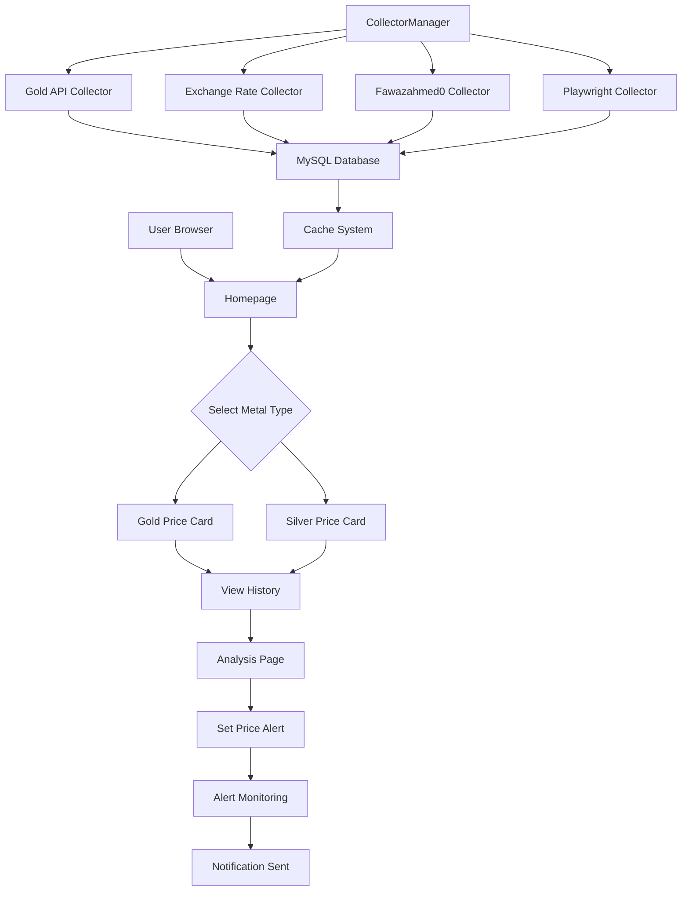

## 1. Product Overview
AU Metal Price Collection and Analysis Platform是一个用于采集、存储与查询黄金/白银价格的轻量级服务平台。该平台通过多源数据采集、实时价格监控、历史趋势分析等功能，为贵金属投资者和相关从业者提供准确的价格信息和专业的行情分析工具。

平台主要解决贵金属价格信息分散、数据不及时、缺乏专业分析工具等问题，帮助用户快速获取准确的金属价格数据，进行价格趋势分析和投资决策支持。

## 2. Core Features

### 2.1 User Roles
该平台主要服务于以下用户群体：

| Role | Registration Method | Core Permissions |
|------|---------------------|------------------|
| Visitor | No registration required | Browse price data, view charts, use basic analysis tools |
| Registered User | Email registration | Save preferences, set price alerts, access historical data export |
| Premium User | Subscription upgrade | Advanced analytics, custom alerts, API access priority |

### 2.2 Feature Module
Our AU Metal Price Platform consists of the following main pages:

1. **Homepage**: Real-time price display, price cards for gold/silver, trend charts, quick navigation
2. **History Page**: 7-day price trends, historical data visualization, interactive charts
3. **Analysis Page**: Professional market analysis, price comparison tools, technical indicators
4. **Alert Center**: Price alert configuration, notification management, alert history

### 2.3 Page Details
| Page Name | Module Name | Feature description |
|-----------|-------------|---------------------|
| Homepage | Price Cards | Display real-time gold/silver prices with recycle and market prices, show daily high/low prices |
| Homepage | Trend Chart | Show 24-hour price trend using ECharts, support interactive zoom and pan |
| Homepage | Quick Stats | Display price change percentage, daily range, last update time |
| History Page | 7-Day Trend | Show last 7 days recycle price trend with date-based filtering |
| History Page | Interactive Chart | Support multiple time ranges (1d/7d/30d/90d/1y/all) with OHLC data |
| History Page | Data Export | Allow users to export historical data in JSON/CSV format |
| Analysis Page | Market Overview | Provide professional market analysis and price forecasts |
| Analysis Page | Price Calculator | Calculate price differences between purchase price and market price |
| Analysis Page | Gold-Silver Ratio | Display and track gold-to-silver price ratio trends |
| Alert Center | Price Alerts | Set price thresholds with SSE real-time monitoring |
| Alert Center | Notifications | Support WeChat, Telegram, and email notification channels |
| Alert Center | Alert History | Track alert triggers and notification delivery status |

## 3. Core Process

### User Flow - Price Monitoring
1. User visits homepage and sees real-time gold/silver prices
2. User can switch between different data types (gold/silver)
3. System automatically updates prices every minute via multiple data collectors
4. User can view detailed price history and trends
5. User can set price alerts for specific thresholds
6. System monitors prices and sends notifications when thresholds are met

### Data Collection Flow
1. CollectorManager starts multiple collectors (Gold API, Exchange Rate, Fawazahmed0)
2. Optional Playwright collector scrapes target website when enabled
3. Data is validated and stored in MySQL database
4. Cache system reduces database load for frequent queries
5. Real-time updates are pushed to connected clients via SSE

## 4. User Interface Design

### 4.1 Design Style
- **Primary Colors**: Gold (#FFD700) for gold-related elements, Silver (#C0C0C0) for silver-related elements
- **Secondary Colors**: Deep blue (#1E3A8A) for headers, White (#FFFFFF) for backgrounds
- **Button Style**: Modern rounded corners with subtle shadows and hover effects
- **Font**: System default with fallback to sans-serif, 14-16px for body text
- **Layout Style**: Card-based layout with responsive grid system
- **Icons**: Emoji-based icons (🥇 for gold, 🥈 for silver) for intuitive recognition

### 4.2 Page Design Overview
| Page Name | Module Name | UI Elements |
|-----------|-------------|-------------|
| Homepage | Price Cards | Card-based layout with real-time price display, change indicators with color coding (green for up, red for down) |
| Homepage | Trend Chart | Full-width ECharts line chart with time axis, zoom controls, and data point tooltips |
| Homepage | Navigation | Clean top navigation bar with active state indicators and smooth transitions |
| History Page | Trend Visualization | Multi-line charts showing price movements over different time periods |
| Analysis Page | Calculator Tool | Input fields for price calculation with clear result display and comparison metrics |
| Alert Center | Alert Configuration | Form-based interface for setting alert conditions with validation feedback |

### 4.3 Responsiveness
The platform adopts a **desktop-first** design approach with mobile adaptation:
- Primary target: Desktop users (1200px+ width) for professional analysis
- Mobile responsive: Adaptive layout for tablets (768px+) and smartphones (320px+)
- Touch optimization: Larger touch targets and swipe gestures for mobile devices
- Chart responsiveness: ECharts automatically adjust to container size

### 4.4 Data Visualization Guidelines
- **Chart Types**: Line charts for trends, candlestick charts for OHLC data
- **Color Scheme**: Consistent use of gold/silver colors with high contrast
- **Animation**: Smooth transitions and loading animations for better UX
- **Data Density**: Optimized information display avoiding clutter
- **Accessibility**: High contrast ratios and keyboard navigation support