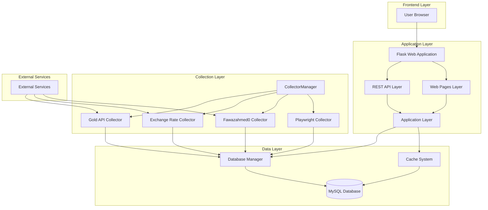
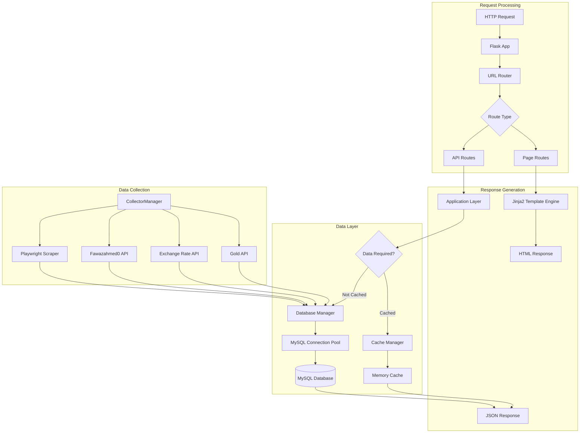
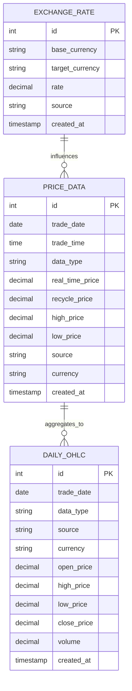

## 1. Architecture Design



## 2. Technology Description

### Core Technology Stack
- **Backend Framework**: Flask@3.x (Python web framework)
- **Database**: MySQL@5.7+ with connection pooling
- **Data Collection**: Python requests + Playwright (browser automation)
- **Frontend**: Jinja2 templates + ECharts.js + vanilla JavaScript
- **Cache**: In-memory TTL cache for API responses
- **Task Scheduling**: Python threading for concurrent collectors
- **JSON Processing**: Custom JSON encoder for Decimal/datetime handling

### Development Environment
- **Python Version**: 3.8+
- **Package Manager**: pip with requirements.txt
- **Containerization**: Docker + Docker Compose
- **Testing**: pytest with coverage reporting
- **Code Style**: PEP 8 compliance

### Key Dependencies
```
flask>=3.0.0
pymysql>=1.0.0
requests>=2.28.0
playwright>=1.40.0
ecrypt>=0.1.0
python-dotenv>=0.19.0
```

## 3. Route Definitions

### Web Pages
| Route | Purpose |
|-------|---------|
| / | Homepage with real-time price cards and trend charts |
| /history | 7-day price history with interactive charts |
| /analysis | Professional market analysis and price calculator |

### REST API Endpoints
| Route | Purpose |
|-------|---------|
| /api/latest-price | Get latest prices for all metal types |
| /api/price-overview | Get price overview with daily stats |
| /api/recent-history | Get recent price history (max 30 records) |
| /api/daily-history | Get intraday history for specific date |
| /api/last-1-hour | Get last 30 minutes of data |
| /api/last-7-days | Get 7-day daily recycle prices |
| /api/price-trend | Get price trends for different time ranges |
| /api/gold-silver-ratio | Get gold-to-silver ratio trends |
| /api/exchange-rate | Get latest exchange rates |
| /api/price-alert/subscribe | SSE endpoint for price alerts |
| /api/price-alert/push | Trigger price alert checks |
| /api/calculate | Calculate price differences |
| /api/health | Health check endpoint |

## 4. API Definitions

### 4.1 Price Data API

#### Get Latest Price
```
GET /api/latest-price
```

**Query Parameters:**
| Param Name | Param Type | isRequired | Description |
|------------|------------|------------|-------------|
| data_type | string | false | Metal type (e.g., "黄 金", "白 银") |

**Response:**
```json
{
  "success": true,
  "data": [
    {
      "trade_date": "2025-11-24",
      "trade_time": "14:30:00",
      "data_type": "黄 金",
      "real_time_price": 585.50,
      "recycle_price": 575.30
    }
  ]
}
```

#### Price Calculation
```
POST /api/calculate
```

**Request Body:**
| Param Name | Param Type | isRequired | Description |
|------------|------------|------------|-------------|
| product_price | decimal | true | Total product price |
| weight | decimal | true | Weight in grams |
| data_type | string | true | Metal type |
| calculation_type | string | false | Type of calculation (default: "purchase") |

**Response:**
```json
{
  "success": true,
  "data": {
    "price_per_gram": 480.0,
    "market_price": 475.3,
    "difference": 4.7,
    "difference_percentage": 0.99,
    "message": "购买价比大盘高 4.70 元/克 (0.99%)"
  }
}
```

### 4.2 Price Alert API (SSE)

#### Subscribe to Price Alerts
```
GET /api/price-alert/subscribe
```

**Query Parameters:**
| Param Name | Param Type | isRequired | Description |
|------------|------------|------------|-------------|
| data_type | string | true | Metal type |
| target | decimal | true | Target price |
| op | string | false | Comparison operator ("gte" or "lte") |
| auto_close | boolean | false | Close connection after alert (default: true) |

**SSE Events:**
- `event: price` - Current price updates
- `event: alert` - Alert triggered notification
- `event: ping` - Keep-alive heartbeat

## 5. Server Architecture Diagram



## 6. Data Model

### 6.1 Data Model Definition



### 6.2 Data Definition Language

#### Price Data Table
```sql
CREATE TABLE IF NOT EXISTS price_data (
  id INT AUTO_INCREMENT PRIMARY KEY,
  trade_date DATE NOT NULL,
  trade_time TIME NOT NULL,
  data_type VARCHAR(50) NOT NULL,
  real_time_price DECIMAL(10, 4) DEFAULT 0,
  recycle_price DECIMAL(10, 4) DEFAULT 0,
  high_price DECIMAL(10, 4) DEFAULT 0,
  low_price DECIMAL(10, 4) DEFAULT 0,
  source VARCHAR(30) DEFAULT 'playwright',
  currency VARCHAR(10) DEFAULT 'CNY',
  created_at TIMESTAMP DEFAULT CURRENT_TIMESTAMP,
  INDEX idx_type_created (data_type, created_at DESC),
  INDEX idx_date_type_recycle (trade_date, data_type, recycle_price),
  INDEX idx_type_date_created (data_type, trade_date, created_at),
  INDEX idx_source (source, data_type, created_at DESC)
) ENGINE=InnoDB DEFAULT CHARSET=utf8mb4 COLLATE=utf8mb4_unicode_ci;
```

#### Exchange Rate Table
```sql
CREATE TABLE IF NOT EXISTS exchange_rate (
  id INT AUTO_INCREMENT PRIMARY KEY,
  base_currency VARCHAR(10) NOT NULL,
  target_currency VARCHAR(10) NOT NULL,
  rate DECIMAL(12, 6) NOT NULL,
  source VARCHAR(30) NOT NULL DEFAULT 'exchange_rate_api',
  created_at TIMESTAMP DEFAULT CURRENT_TIMESTAMP,
  INDEX idx_pair_time (base_currency, target_currency, created_at DESC)
) ENGINE=InnoDB DEFAULT CHARSET=utf8mb4 COLLATE=utf8mb4_unicode_ci;
```

#### Daily OHLC Table
```sql
CREATE TABLE IF NOT EXISTS daily_ohlc (
  id INT AUTO_INCREMENT PRIMARY KEY,
  trade_date DATE NOT NULL,
  data_type VARCHAR(50) NOT NULL,
  source VARCHAR(30) NOT NULL,
  currency VARCHAR(10) DEFAULT 'USD',
  open_price DECIMAL(12, 4),
  high_price DECIMAL(12, 4),
  low_price DECIMAL(12, 4),
  close_price DECIMAL(12, 4),
  volume DECIMAL(20, 4) DEFAULT NULL,
  created_at TIMESTAMP DEFAULT CURRENT_TIMESTAMP,
  UNIQUE KEY uk_date_type_source (trade_date, data_type, source),
  INDEX idx_type_date (data_type, trade_date)
) ENGINE=InnoDB DEFAULT CHARSET=utf8mb4 COLLATE=utf8mb4_unicode_ci;
```

## 7. Performance Optimization

### Database Optimization
- **Connection Pooling**: MySQL connection pool with 5 default connections
- **Index Strategy**: Optimized indexes for frequent queries (date, type, price combinations)
- **Batch Operations**: Bulk insert operations for data collection efficiency
- **Query Optimization**: Parameterized queries to prevent SQL injection and improve performance

### Caching Strategy
- **TTL Cache**: In-memory cache with configurable TTL for API responses
- **Cache Keys**: Type-based caching for price overview and trend data
- **Cache Invalidation**: Automatic invalidation based on data update frequency

### Collection Optimization
- **Concurrent Collectors**: Multiple collectors running in parallel threads
- **Batch Processing**: Collectors batch insert data to reduce database operations
- **Error Handling**: Graceful degradation when external services are unavailable
- **Rate Limiting**: Configurable collection intervals to prevent API overload

## 8. Security Considerations

### Data Security
- **Environment Variables**: All sensitive configuration stored in environment variables
- **SQL Injection Prevention**: Parameterized queries throughout the application
- **Input Validation**: Server-side validation for all user inputs
- **Error Handling**: Secure error messages that don't expose system internals

### Deployment Security
- **Docker Security**: Non-root user execution in containers
- **Network Security**: Internal network isolation for database connections
- **Log Security**: Sensitive data redaction in logs
- **HTTPS Support**: Ready for SSL/TLS termination at reverse proxy level