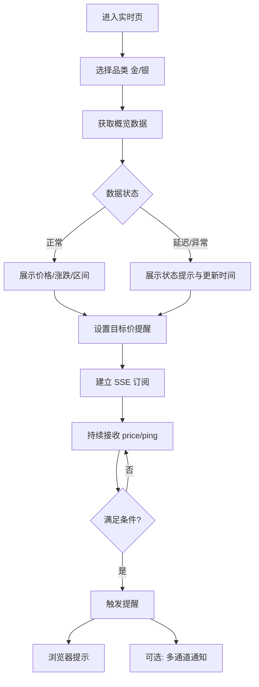
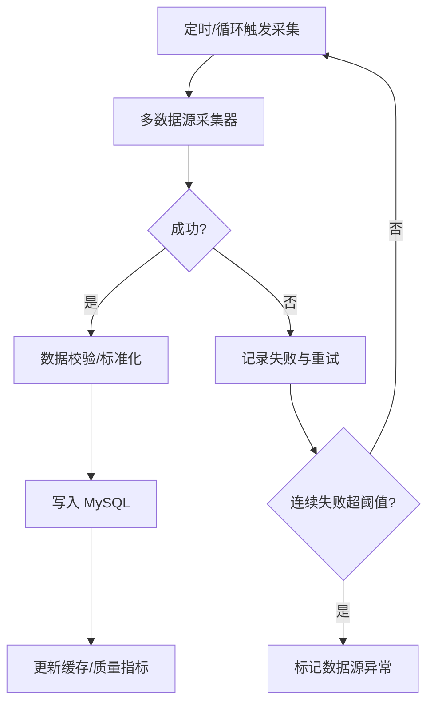

# AU Metal Price Platform｜产品需求文档（PRD）

版本：V0.2（面向可交付迭代）

文档状态：Draft

更新时间：2026-05-12

相关文档：
- 产品分析评估：`docs/Product_Analysis.md`

## 0. 修订记录

| 版本 | 日期 | 作者 | 说明 |
|---|---|---|---|
| V0.2 | 2026-05-12 | PM | 基于现有仓库实现重写 PRD，补齐完整模块 |

## 1. 项目背景

### 1.1 行业现状

贵金属价格信息分散在不同平台与数据源，存在口径不一致、刷新频率不透明、缺少可追溯历史数据等问题。对投资者而言，缺少低成本的“目标价提醒”；对回收/金店从业者而言，缺少“报价与毛利空间”的快速计算；对数据用户而言，缺少稳定可用且可解释的数据接口。

### 1.2 问题与机会

- 信息不对称：不同来源价格差异大，用户无法判断可信度。
- 任务不闭环：多数行情展示不提供“提醒/计算/导出/API”等任务工具。
- 自建成本高：用户自行维护采集脚本不稳定、难扩展。

本项目机会在于提供“采集-存储-分析-提醒”的可控闭环，并以数据可信度与专业提醒作为差异化。

## 2. 产品目标

### 2.1 产品愿景

成为贵金属用户的“可信价格底座 + 任务型工具箱”，支持看盘、分析、提醒与业务决策。

### 2.2 阶段目标（MVP → 可商业化）

MVP（V0.2）
- 让用户在 30 秒内完成：查看当前金/银关键价 → 看近 7 天趋势 → 设置一个目标价提醒。
- 让系统在数据源波动时：清晰展示数据更新时间与异常态，并可降级服务。

商业化准备（V0.3-V1.0）
- 具备“数据质量/可观测/SLA”基础能力。
- 支持多通道提醒配置与历史追溯。
- 支持导出与 API Key（面向 B2B/开发者）。

### 2.3 成功指标（OKR）

- O1：形成稳定的实时与历史数据供给
  - KR1：核心品类（黄金/白银）价格数据新鲜度 P95 ≤ 120s
  - KR2：采集成功率（日维度）≥ 99%
  - KR3：异常值可识别并标记（异常率 ≤ 0.5%，且可追溯）

- O2：提高用户任务完成效率
  - KR1：设置提醒完成率 ≥ 30%（访问首页用户）
  - KR2：提醒触发到达率 ≥ 98%（按通道）
  - KR3：计算器使用率 ≥ 20%

## 3. 产品定位与差异化

### 3.1 一句话定位

面向贵金属投资与回收报价的“可控数据 + 实时提醒 + 任务型分析工具”平台。

### 3.2 核心卖点

- 多源采集与口径可解释（数据源、更新时间、冲突策略透明）。
- 价格提醒闭环（浏览器实时订阅 + 多通道通知）。
- 任务型工具（价差/溢价/金银比/区间趋势、导出、API）。
- 轻量部署（可私有化，自建成本低）。

## 4. 目标用户与用户画像

### 4.1 用户分层

1) 个人投资者（轻中度）
- 关注：目标价、短周期趋势、金银比。
- 价值：提醒 + 基础分析。

2) 回收/金店从业者（高频）
- 关注：回收价/大盘价差、汇率影响、日内高低。
- 价值：计算器 + 快速对比。

3) 数据用户（开发者/机构）
- 关注：稳定性、历史 OHLC、数据追溯、API。
- 价值：数据接口 + SLA。

### 4.2 用户痛点映射

| 痛点 | 体现 | 对应能力 |
|---|---|---|
| 数据分散不可信 | 价格差异大、来源不透明 | 数据源标识、更新频率、异常标记、质量指标 |
| 无法及时捕捉机会 | 盯盘成本高 | 目标价提醒、分通道通知、触发历史 |
| 缺少任务工具 | 报价/回收/投资计算麻烦 | 价差/盈亏/溢价计算器、模板参数 |
| 历史数据难用 | 回测/对比困难 | OHLC、区间趋势、导出、API |

## 5. 需求范围

### 5.1 本期范围（V0.2）

- P0：价格概览、趋势与历史、提醒、计算器、数据可信度最小闭环、异常态与降级。
- P1：通知通道管理、提醒历史、导出（CSV/JSON）、基础运维页（健康度/采集状态）。

### 5.2 不在本期范围

- 内容资讯、社区、交易下单。
- 复杂账户体系与会员订阅（可在 V1.0 前评估）。
- 多品类扩展（铂金/钯金/原油等）作为后续扩展。

## 6. 功能需求（按模块）

### 6.1 信息架构与导航

#### 6.1.1 顶部导航（P0）

- 导航项：`实时` / `历史` / `分析` / `提醒` / `设置`（设置可在 V0.2 先隐藏）。
- 支持在页面内切换品类：黄金/白银。

验收标准
- 在任意页面 1 次点击可回到实时页。
- 品类切换后，页面展示与 API 请求口径一致。

### 6.2 实时价格概览（P0）

目标：让用户快速掌握“当前价 + 今日区间 + 涨跌 + 更新时间 + 数据可信度”。

#### 6.2.1 价格卡片

- 展示字段（黄金/白银各一张卡片）：
  - 当前价（回收/大盘/或明确口径）
  - 昨收/今日开盘（若可得）
  - 今日最高/最低
  - 涨跌额与涨跌幅
  - 更新时间（数据点时间）
  - 数据源（显示主源，支持展开查看多源）

#### 6.2.2 数据可信度提示（P0）

- 可信度状态（展示在卡片角标）：
  - 正常：P95 延迟 ≤ 120s
  - 延迟：120s < 延迟 ≤ 600s
  - 异常：延迟 > 600s 或连续失败
- 状态点击后展示：最近 1 小时缺失率、数据源切换信息。

验收标准
- 当数据源不可用时，前端明确提示“数据延迟/异常”，且不展示误导性数值（例如用旧数据冒充实时）。

### 6.3 历史与趋势（P0）

#### 6.3.1 近 1 小时分钟线

- 默认展示最近 60 分钟（或近 N 条）
- 支持缩放与悬浮提示（时间/价格/来源）

#### 6.3.2 近 7 天日趋势

- 展示日维度回收价曲线，显示最高/最低/收盘
- 支持对比：黄金 vs 白银（可选开关）

#### 6.3.3 区间趋势（OHLC）

- 支持区间：1d/7d/30d/90d/1y/all（以数据可得性为准）
- 展示 K 线 + 成交量（如无则不展示）+ 指标占位（V0.3 逐步加入）

验收标准
- 区间切换请求成功率 ≥ 99%，失败时提示可重试。

### 6.4 分析工具（P0）

#### 6.4.1 金银比（P0）

- 展示金银比曲线（同区间选择）
- 支持阈值提醒（P1，可复用提醒模块）

#### 6.4.2 价差/溢价计算器（P0）

支持两类计算：

1) 购买价 vs 大盘
- 输入：总价、克重、品类、时间点（默认当前）
- 输出：每克成本、当前大盘、差额/差额百分比、解读文案

2) 回收报价建议（P1）
- 输入：目标毛利、损耗、手续费（可选）
- 输出：建议回收价区间

验收标准
- 对非法输入（空、负数、过大）给出明确提示；计算结果可复制。

### 6.5 价格提醒与通知（P0-P1）

#### 6.5.1 提醒规则（P0）

- 条件：品类 + 目标价 + 触发方向（≥ / ≤）
- 行为：触发后
  - 浏览器端弹窗/声音提示（可配置）
  - 可选：自动关闭 SSE 连接

#### 6.5.2 通知通道（P1）

- 通道：企业微信/Telegram/邮件
- 能力：测试发送、失败重试（最多 N 次）、送达状态记录

#### 6.5.3 提醒历史（P1）

- 记录字段：提醒 ID、用户标识（匿名/登录用户）、条件、创建时间、触发时间、触发时价格、通知通道与状态

验收标准
- 单个提醒触发后不会重复刷屏（除非用户选择“持续提醒”）。

### 6.6 数据源与采集管理（P1）

目标：提升可运维性与数据可信度。

- 采集任务列表：每个数据源的最近成功时间、失败次数、平均延迟、限流状态。
- 开关与优先级：启用/禁用数据源；指定主源与备源。
- 冲突策略（V0.3）：多源差异超过阈值时标记异常，并选择主源写入。

### 6.7 数据导出与 API（P1）

- 导出：按品类 + 时间范围导出 CSV/JSON（限流）。
- API Key（V0.3）：为开发者提供带配额与限流的访问。

## 7. 非功能需求

### 7.1 性能

- 价格概览接口：P95 响应时间 ≤ 200ms（缓存命中）/ ≤ 800ms（不命中）
- 历史趋势接口：P95 ≤ 1.5s
- SSE：单实例稳定维持 N（默认 1k）连接，超过阈值需降级策略（例如仅推送事件、不推送每次 price）。

### 7.2 可用性与稳定性

- 关键接口可用性 ≥ 99.5%（MVP），商业化目标 ≥ 99.9%
- 采集与 Web 解耦方案纳入 V0.3（减少互相影响）

### 7.3 安全

- 不在前端暴露任何第三方密钥
- API 基础防护：限流、基础 WAF 规则（如有网关）、输入校验
- 通知通道：Webhook/Token 加密存储（或仅服务端环境变量）

### 7.4 可观测

- 指标：采集成功率、延迟、缺失率、异常值率、接口 P95、SSE 连接数、通知送达率
- 日志：结构化日志，关键链路包含 request_id/collector_id

### 7.5 兼容性

- Web：Chrome/Edge 最新 2 个大版本
- 移动端：优先保证可用与可读（图表可简化）

## 8. 用户故事

### 8.1 投资者（个人）

- 作为投资者，我想在首页立刻看到黄金与白银的当前价与涨跌，这样我能快速判断是否需要进一步分析。
- 作为投资者，我想设置“黄金价格 ≤ X”的提醒，这样我不需要持续盯盘。
- 作为投资者，我想查看近 7 天的趋势，这样我能判断短期方向。

### 8.2 回收/金店从业者

- 作为门店人员，我想输入总价与克重并立即得到每克成本与大盘差额，这样我能快速评估报价是否合理。
- 作为门店人员，我想看到今日高低区间与更新时间，这样我能避免用过期价格报价。

### 8.3 数据用户

- 作为开发者，我想拉取指定时间范围的 OHLC 数据，这样我能做回测与对比。
- 作为机构用户，我想知道数据源与异常标记策略，这样我能评估数据是否可用于业务。

## 9. 业务流程图

### 9.1 用户看盘与提醒流程

### 9.2 数据采集与入库流程

## 10. 原型图说明（文字原型）

### 10.1 实时页（/）

- 顶部：导航栏 + 品类切换（黄金/白银）
- 主区块：两张价格卡片（黄金、白银）
  - 左上：品类与数据状态角标
  - 中部：当前价（大号）+ 涨跌额/涨跌幅（红绿）
  - 底部：今日高/低、更新时间、数据源（可展开）
- 趋势区块：近 1 小时分钟线（默认）
- 工具区块：计算器（输入区 + 结果区）
- 提醒区块：目标价 + 方向 + 订阅按钮 + 当前订阅状态

### 10.2 历史页（/history）

- 顶部：区间切换（7d/30d/90d/1y/all）
- 图表 1：近 7 天日趋势（默认展示）
- 图表 2：区间 OHLC（K 线）
- 操作：导出按钮（P1），选择格式与范围

### 10.3 分析页（/analysis）

- 左侧：品类与时间范围选择
- 主区块：
  - 金银比曲线
  - 指标区：溢价/波动（V0.3 扩展）
  - 解释说明：口径、数据源、更新时间

### 10.4 提醒页（/alerts，V0.2 可选）

- 提醒列表：条件、状态、创建时间、最近触发
- 新建提醒：表单（品类/目标价/方向/通道）
- 通道管理入口：企业微信/Telegram/邮件配置与测试

## 11. 数据指标定义（埋点与口径）

实现细节与 Umami 事件映射见 [`docs/umami-integration.md`](umami-integration.md)。

### 11.1 用户行为指标

- `uv_daily`：日独立访客数（按匿名 id 或登录 id 去重）
- `dau`：日活用户（当日触发任意页面浏览或接口请求）
- `alert_create_rate`：创建提醒人数 / 实时页访问人数
- `calculator_use_rate`：使用计算器人数 / 实时页访问人数
- `export_use_rate`：导出人数 / 历史页访问人数（P1）

### 11.2 数据质量指标

- `freshness_p95_seconds`：数据点时间到“被 API 返回”的 P95 延迟
- `collector_success_rate`：采集成功次数 / 采集总次数（日维度）
- `missing_rate`：期望采集点数缺失比例（按品类与数据源分组）
- `outlier_rate`：被标记为异常的数据点占比

### 11.3 可靠性指标

- `api_p95_ms`：核心 API（概览/趋势/比率）P95 响应
- `sse_concurrent_connections`：SSE 并发连接数
- `notify_delivery_rate`：通知送达成功 / 发送总数（按通道）

## 12. 风险评估与应对

| 风险 | 影响 | 可能性 | 应对策略 |
|---|---|---:|---|
| 第三方数据源限流/收费 | 数据中断、成本上升 | 高 | 多源备份、缓存降级、可配置开关、评估付费 API |
| 抓取合规与封禁 | 法律/可用性风险 | 中 | 优先使用公开 API；抓取作为可选并加白名单与频控 |
| 数据口径争议 | 信任下降 | 中 | 明确“口径说明”、展示数据源与更新时间、提供差异提示 |
| 采集与 Web 耦合导致雪崩 | 可用性下降 | 中 | V0.3 拆分采集进程/服务，增加隔离与熔断 |
| 通知通道失败 | 提醒价值受损 | 中 | 重试、送达状态、备用通道、告警 |
| 两套前端并行 | 交付变慢 | 高 | 明确主路线与迁移计划，统一数据类型与 UI 组件 |

## 13. 迭代计划

### V0.2（1-2 周）：可用的“可信度 + 提醒”闭环

- P0：统一品类枚举与口径、实时概览/历史/分析页异常态、提醒基础体验、核心指标上报
- P1：通道配置与测试、提醒历史、导出

### V0.3（2-4 周）：稳定性与可运维

- 采集与 Web 解耦（独立进程/服务）；引入分布式缓存（如 Redis）
- 数据源管理页与冲突策略；质量指标落地（缺失/延迟/异常）
- API Key + 限流

### V1.0（4-8 周）：商业化准备

- 角色与权限（匿名/登录/团队）
- SLA 与告警（通知送达、采集失败、接口错误）
- 计费策略与配额（如走 SaaS/API）

## 14. 需求验收清单（V0.2）

- 核心页面：实时/历史/分析至少 3 种异常态可正确提示（无数据/延迟/接口失败）。
- 提醒：可创建、可触发、触发后不重复刷屏；浏览器端可看到触发原因与触发价。
- 数据可信度：价格卡片展示更新时间与状态；状态口径与后端指标一致。
- 指标：至少能产出 freshness、collector_success_rate、notify_delivery_rate 三类指标。

