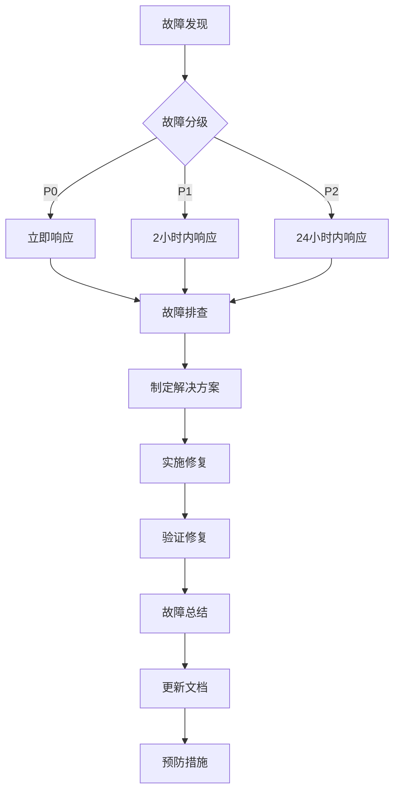

# AU贵金属价格平台开发规范与CI/CD说明

## 1. 开发规范总则

### 1.1 规范目标
- 确保代码质量和可维护性
- 统一团队开发风格和标准
- 提高开发效率和协作效果
- 降低系统维护成本

### 1.2 适用范围
本规范适用于AU贵金属价格平台的所有前端、后端开发工作，包括代码编写、测试、文档等各个环节。

## 2. 前端开发规范

### 2.1 技术栈规范
- **框架**：React 18+ with TypeScript
- **构建工具**：Vite 4+
- **样式方案**：TailwindCSS 3+
- **状态管理**：React Context + useReducer
- **路由**：React Router v6
- **HTTP客户端**：Axios

### 2.2 代码组织规范

#### 2.2.1 项目目录结构
```
src/
├── components/          # 通用组件
│   ├── common/           # 基础组件
│   ├── layout/           # 布局组件
│   └── ui/               # UI组件库
├── pages/                # 页面组件
│   ├── home/
│   ├── dashboard/
│   └── alerts/
├── hooks/                # 自定义Hooks
├── services/             # API服务
├── store/                # 状态管理
├── utils/                # 工具函数
├── types/                # TypeScript类型定义
├── styles/               # 全局样式
└── constants/            # 常量定义
```

#### 2.2.2 组件命名规范
- **文件夹命名**：使用kebab-case，如：`price-chart/`
- **组件文件**：使用PascalCase，如：`PriceChart.tsx`
- **样式文件**：与组件同名，如：`PriceChart.css`
- **测试文件**：`.test.tsx`后缀，如：`PriceChart.test.tsx`

#### 2.2.3 组件开发规范
```typescript
// 组件Props接口定义
interface PriceChartProps {
  data: PriceData[];
  height?: number;
  onDataPointClick?: (data: PriceData) => void;
}

// 函数组件定义
const PriceChart: React.FC<PriceChartProps> = ({ 
  data, 
  height = 400, 
  onDataPointClick 
}) => {
  // 组件逻辑
  
  return (
    // JSX渲染
  );
};

export default PriceChart;
```

### 2.3 编码规范

#### 2.3.1 TypeScript使用规范
- 所有组件和工具函数必须使用TypeScript
- 明确定义接口和类型，避免使用`any`类型
- 使用严格模式，启用所有TypeScript严格检查

```typescript
// ✅ 推荐：明确定义类型
interface User {
  id: string;
  email: string;
  name: string;
  role: 'user' | 'admin';
}

// ❌ 避免：使用any类型
const getUser = (id: any): any => {
  // ...
};
```

#### 2.3.2 React Hooks使用规范
```typescript
// ✅ 推荐：按规则使用Hooks
const Component = () => {
  const [price, setPrice] = useState<number>(0);
  const [loading, setLoading] = useState<boolean>(false);
  
  useEffect(() => {
    // 副作用处理
    fetchPrice();
  }, []); // 正确的依赖数组
  
  return // JSX
};

// ❌ 避免：在条件语句中使用Hooks
if (condition) {
  const [price, setPrice] = useState<number>(0);
}
```

#### 2.3.3 样式规范
- 使用TailwindCSS类名，避免内联样式
- 遵循移动端优先的响应式设计原则
- 统一使用rem单位进行字体大小设置

```tsx
// ✅ 推荐：使用TailwindCSS
<div className="flex flex-col md:flex-row items-center justify-between p-4">
  <h1 className="text-2xl font-bold text-gray-900 mb-2 md:mb-0">
    黄金价格监控
  </h1>
</div>

// ❌ 避免：内联样式
<div style={{ display: 'flex', flexDirection: 'column' }}>
```

## 3. 后端开发规范

### 3.1 技术栈规范
- **后端服务**：Supabase（BaaS）
- **数据库**：PostgreSQL 15
- **运行时**：Node.js 20
- **语言**：TypeScript
- **缓存**：Redis 7
- **API**：RESTful + WebSocket

### 3.2 数据库设计规范

#### 3.2.1 命名规范
- **表名**：使用snake_case复数形式，如：`price_data`
- **字段名**：使用snake_case，如：`created_at`
- **索引名**：`idx_表名_字段名`，如：`idx_price_data_metal_time`
- **约束名**：`pk_表名`、`fk_表名_字段名`

#### 3.2.2 表结构设计
```sql
-- 用户表示例
CREATE TABLE users (
    id UUID PRIMARY KEY DEFAULT gen_random_uuid(),
    email VARCHAR(255) UNIQUE NOT NULL,
    password_hash VARCHAR(255) NOT NULL,
    name VARCHAR(100) NOT NULL,
    role VARCHAR(20) DEFAULT 'user' CHECK (role IN ('user', 'admin')),
    is_active BOOLEAN DEFAULT true,
    preferences JSONB DEFAULT '{}',
    created_at TIMESTAMP WITH TIME ZONE DEFAULT NOW(),
    updated_at TIMESTAMP WITH TIME ZONE DEFAULT NOW()
);

-- 必要索引
CREATE INDEX idx_users_email ON users(email);
CREATE INDEX idx_users_created_at ON users(created_at DESC);
```

#### 3.2.3 数据类型规范
- 主键：统一使用UUID类型
- 时间戳：使用`TIMESTAMP WITH TIME ZONE`
- 金额：使用`DECIMAL(precision, scale)`
- JSON数据：使用`JSONB`类型
- 布尔值：使用`BOOLEAN`类型

### 3.3 API设计规范

#### 3.3.1 RESTful API规范
```typescript
// 统一的API响应格式
interface ApiResponse<T> {
  status: 'success' | 'error';
  message: string;
  data?: T;
  error?: {
    code: string;
    message: string;
    details?: any;
  };
  timestamp: string;
}

// 分页响应格式
interface PaginatedResponse<T> {
  status: 'success';
  data: T[];
  pagination: {
    page: number;
    limit: number;
    total: number;
    totalPages: number;
  };
  timestamp: string;
}
```

#### 3.3.2 HTTP状态码规范
- `200 OK`：成功获取资源
- `201 Created`：成功创建资源
- `400 Bad Request`：请求参数错误
- `401 Unauthorized`：未认证
- `403 Forbidden`：权限不足
- `404 Not Found`：资源不存在
- `500 Internal Server Error`：服务器内部错误

#### 3.3.3 API端点命名规范
```
GET    /api/prices/current      # 获取当前价格
GET    /api/prices/history      # 获取历史价格
POST   /api/alerts/rules        # 创建预警规则
PUT    /api/alerts/rules/:id    # 更新预警规则
DELETE /api/alerts/rules/:id    # 删除预警规则
```

## 4. 代码质量规范

### 4.1 代码审查规范

#### 4.1.1 Code Review流程
1. **创建Pull Request**：功能开发完成后创建PR
2. **自我检查**：开发者先进行自我代码审查
3. **同伴审查**：至少1名团队成员进行代码审查
4. **测试验证**：确保所有测试通过
5. **合并代码**：审查通过后合并到主分支

#### 4.1.2 Code Review检查清单
- [ ] 代码符合编码规范
- [ ] 功能实现正确完整
- [ ] 错误处理机制完善
- [ ] 性能优化考虑充分
- [ ] 安全性检查通过
- [ ] 文档和注释完整
- [ ] 测试覆盖率达标

### 4.2 测试规范

#### 4.2.1 测试分层策略
```
测试金字塔：
├── E2E测试（10%）
├── 集成测试（30%）
└── 单元测试（60%）
```

#### 4.2.2 单元测试规范
```typescript
// 组件单元测试示例
describe('PriceChart Component', () => {
  it('should render price data correctly', () => {
    const mockData = [
      { time: '2024-01-01', price: 450.50 },
      { time: '2024-01-02', price: 451.25 }
    ];
    
    render(<PriceChart data={mockData} />);
    
    expect(screen.getByText('450.50')).toBeInTheDocument();
    expect(screen.getByText('451.25')).toBeInTheDocument();
  });
  
  it('should handle empty data gracefully', () => {
    render(<PriceChart data={[]} />);
    
    expect(screen.getByText('暂无数据')).toBeInTheDocument();
  });
});
```

#### 4.2.3 测试覆盖率要求
- **单元测试覆盖率**：≥80%
- **核心功能覆盖率**：≥90%
- **分支覆盖率**：≥70%

### 4.3 文档规范

#### 4.3.1 代码注释规范
```typescript
/**
 * 计算价格涨跌幅
 * @param currentPrice - 当前价格
 * @param previousPrice - 之前价格
 * @returns 涨跌幅百分比，保留2位小数
 * @throws 当输入价格无效时抛出错误
 * @example
 * ```typescript
 * const change = calculatePriceChange(450.50, 445.25); // 返回 1.18
 * ```
 */
export const calculatePriceChange = (
  currentPrice: number,
  previousPrice: number
): number => {
  if (currentPrice <= 0 || previousPrice <= 0) {
    throw new Error('价格必须大于0');
  }
  
  const change = ((currentPrice - previousPrice) / previousPrice) * 100;
  return Math.round(change * 100) / 100;
};
```

#### 4.3.2 README文档模板
```markdown
# 组件名称

## 功能描述
简要描述组件的功能和用途

## 使用示例
```tsx
import ComponentName from './ComponentName';

function App() {
  return <ComponentName prop1="value1" prop2={value2} />;
}
```

## Props说明
| 属性名 | 类型 | 必填 | 默认值 | 说明 |
|--------|------|------|--------|------|
| prop1 | string | 是 | - | 属性1说明 |
| prop2 | number | 否 | 0 | 属性2说明 |

## 注意事项
- 使用注意事项1
- 使用注意事项2
```

## 5. CI/CD流程规范

### 5.1 Git分支管理规范

#### 5.1.1 分支策略（Git Flow）
```
main
├── develop
│   ├── feature/user-authentication
│   ├── feature/price-monitoring
│   └── feature/alert-system
├── release/v1.0.0
└── hotfix/critical-bug
```

#### 5.1.2 分支命名规范
- **功能分支**：`feature/功能名称`
- **修复分支**：`bugfix/问题描述`
- **热修复分支**：`hotfix/紧急问题`
- **发布分支**：`release/版本号`

#### 5.1.3 提交信息规范
```
<type>(<scope>): <subject>

<body>

<footer>
```

**提交类型**：
- `feat`：新功能
- `fix`：Bug修复
- `docs`：文档更新
- `style`：代码格式调整
- `refactor`：代码重构
- `test`：测试相关
- `chore`：构建过程或辅助工具的变动

**提交示例**：
```
feat(price): 添加实时价格监控功能

- 集成WebSocket实现实时数据推送
- 添加价格变化动画效果
- 优化移动端显示体验

Closes #123
```

### 5.2 CI/CD流水线配置

#### 5.2.1 GitHub Actions配置
```yaml
# .github/workflows/ci.yml
name: CI/CD Pipeline

on:
  push:
    branches: [ main, develop ]
  pull_request:
    branches: [ main, develop ]

jobs:
  test:
    runs-on: ubuntu-latest
    
    strategy:
      matrix:
        node-version: [18.x, 20.x]
    
    steps:
    - uses: actions/checkout@v4
    
    - name: Use Node.js ${{ matrix.node-version }}
      uses: actions/setup-node@v4
      with:
        node-version: ${{ matrix.node-version }}
        cache: 'npm'
    
    - name: Install dependencies
      run: npm ci
    
    - name: Run linter
      run: npm run lint
    
    - name: Run tests
      run: npm run test:coverage
    
    - name: Build application
      run: npm run build
    
    - name: Upload coverage reports
      uses: codecov/codecov-action@v3
      with:
        file: ./coverage/lcov.info
        flags: unittests
        name: codecov-umbrella
```

#### 5.2.2 自动化测试流程
```yaml
# 测试阶段
- name: Run unit tests
  run: npm run test:unit

- name: Run integration tests
  run: npm run test:integration

- name: Run E2E tests
  run: npm run test:e2e

# 质量检查
- name: Code quality check
  run: |
    npm run lint
    npm run type-check
    npm run security-audit
```

#### 5.2.3 部署流程配置
```yaml
# 生产环境部署
- name: Deploy to production
  if: github.ref == 'refs/heads/main'
  run: |
    # 构建生产版本
    npm run build:prod
    
    # 部署到服务器
    rsync -avz --delete dist/ ${{ secrets.PRODUCTION_SERVER }}:/var/www/au-metal-platform/
    
    # 重启服务
    ssh ${{ secrets.PRODUCTION_SERVER }} 'sudo systemctl restart au-metal-platform'

# 预发布环境部署
- name: Deploy to staging
  if: github.ref == 'refs/heads/develop'
  run: |
    npm run build:staging
    rsync -avz --delete dist/ ${{ secrets.STAGING_SERVER }}:/var/www/au-metal-platform-staging/
```

### 5.3 环境管理规范

#### 5.3.1 环境配置
```typescript
// 环境变量配置
interface EnvironmentConfig {
  NODE_ENV: 'development' | 'staging' | 'production';
  API_URL: string;
  SUPABASE_URL: string;
  SUPABASE_ANON_KEY: string;
  REDIS_URL: string;
  SMTP_CONFIG: SmtpConfig;
  SMS_CONFIG: SmsConfig;
}

// 不同环境的配置
const environments: Record<string, EnvironmentConfig> = {
  development: {
    NODE_ENV: 'development',
    API_URL: 'http://localhost:3000',
    SUPABASE_URL: process.env.SUPABASE_URL_DEV,
    SUPABASE_ANON_KEY: process.env.SUPABASE_ANON_KEY_DEV,
    REDIS_URL: 'redis://localhost:6379',
    SMTP_CONFIG: { /* 开发环境配置 */ },
    SMS_CONFIG: { /* 开发环境配置 */ }
  },
  production: {
    NODE_ENV: 'production',
    API_URL: 'https://api.au-metal-platform.com',
    SUPABASE_URL: process.env.SUPABASE_URL_PROD,
    SUPABASE_ANON_KEY: process.env.SUPABASE_ANON_KEY_PROD,
    REDIS_URL: process.env.REDIS_URL_PROD,
    SMTP_CONFIG: { /* 生产环境配置 */ },
    SMS_CONFIG: { /* 生产环境配置 */ }
  }
};
```

#### 5.3.2 部署检查清单
- [ ] 代码审查通过
- [ ] 所有测试通过
- [ ] 构建成功无错误
- [ ] 环境变量配置正确
- [ ] 数据库迁移完成
- [ ] 缓存服务正常
- [ ] 监控告警配置
- [ ] 回滚方案准备

## 6. 监控与运维规范

### 6.1 应用监控

#### 6.1.1 性能监控指标
- **响应时间**：API平均响应时间 < 500ms
- **错误率**：HTTP错误率 < 1%
- **吞吐量**：支持1000并发用户
- **资源使用率**：CPU < 70%，内存 < 80%

#### 6.1.2 业务监控指标
- **价格更新延迟**：< 30秒
- **预警触发成功率**：> 99%
- **通知发送成功率**：> 95%
- **用户活跃度**：日活跃用户数量

### 6.2 日志管理规范

#### 6.2.1 日志级别定义
```typescript
enum LogLevel {
  ERROR = 'error',    // 错误信息
  WARN = 'warn',      // 警告信息
  INFO = 'info',      // 一般信息
  DEBUG = 'debug'     // 调试信息
}

interface LogEntry {
  timestamp: string;
  level: LogLevel;
  message: string;
  context?: Record<string, any>;
  error?: Error;
}
```

#### 6.2.2 日志格式规范
```json
{
  "timestamp": "2024-01-15T10:30:00.000Z",
  "level": "error",
  "message": "价格数据采集失败",
  "context": {
    "dataSource": "jin10",
    "metal": "au",
    "retryCount": 3
  },
  "error": {
    "name": "NetworkError",
    "message": "Connection timeout",
    "stack": "..."
  }
}
```

### 6.3 故障处理流程

#### 6.3.1 故障分级
- **P0（紧急）**：系统不可用，需要立即处理
- **P1（高）**：核心功能受影响，2小时内处理
- **P2（中）**：一般功能问题，24小时内处理
- **P3（低）**：优化建议，计划内处理

#### 6.3.2 应急响应流程


---

*文档版本：v1.0*
*创建时间：2026年5月*
*最后更新：2026年5月*
*负责人：技术团队*