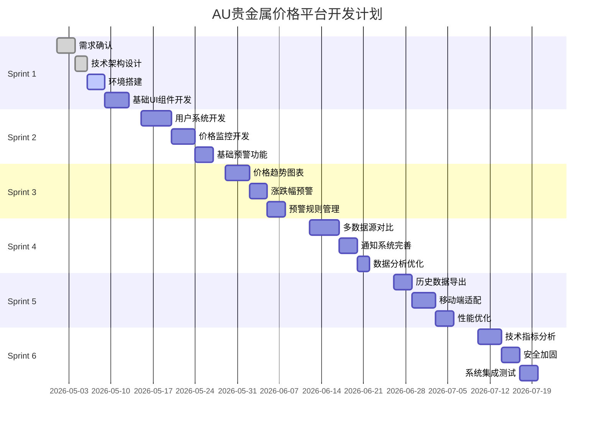

# AU贵金属价格平台迭代开发计划

## 1. 项目概述

### 1.1 项目目标
打造专业、实时、智能的AU贵金属价格监控与预警平台，为贵金属投资者提供准确的价格信息和及时的预警服务。

### 1.2 开发策略
采用敏捷开发模式，以2周为一个Sprint进行迭代开发，优先实现核心功能，逐步完善产品功能。

### 1.3 团队配置
- **前端开发**：2人
- **后端开发**：2人  
- **UI/UX设计**：1人
- **测试工程师**：1人
- **产品经理**：1人

## 2. 迭代计划总览



## 3. Sprint详细计划

### 3.1 Sprint 1 (2026-05-01 ~ 2026-05-14) - 基础架构搭建

#### 3.1.1 目标和范围
**目标**：完成项目初始化和技术架构搭建，建立开发环境和基础组件库。

**范围**：
- ✅ 需求文档和技术架构确认
- ✅ 开发环境和工具链搭建
- ✅ 基础UI组件库开发
- ✅ 项目架构和目录结构建立

#### 3.1.2 Story和Task分解

**Story 1：项目初始化和技术架构搭建**
```
作为开发团队，我们需要完成项目初始化和技术架构设计，以便后续开发工作顺利进行。

验收标准：
- 项目仓库创建完成，包含完整的目录结构
- 技术栈选定并配置完成
- 开发环境搭建完成，团队成员可以正常开发
- 架构设计文档编写完成并通过评审
```

| Task ID | Task描述 | 负责人 | 估时 | 优先级 | DoD |
|---------|----------|--------|------|--------|-----|
| S1-T1 | 创建项目仓库和目录结构 | 前端开发 | 4h | 高 | 代码仓库创建，README文档完成 |
| S1-T2 | 配置开发环境和工具链 | 全团队 | 8h | 高 | ESLint、Prettier、Husky配置完成 |
| S1-T3 | 设计系统架构和数据库模型 | 后端开发 | 8h | 高 | 架构图和数据库设计文档完成 |
| S1-T4 | 搭建Supabase服务和数据库 | 后端开发 | 6h | 高 | Supabase项目创建，基础表结构建立 |
| S1-T5 | 配置CI/CD流水线 | 全团队 | 6h | 中 | GitHub Actions配置完成 |

**Story 2：基础UI组件库开发**
```
作为前端开发团队，我们需要开发一套统一的基础UI组件库，以确保界面风格一致性。

验收标准：
- 基础组件（按钮、输入框、卡片等）开发完成
- 组件样式符合设计规范
- 组件文档和示例编写完成
- 组件通过单元测试
```

| Task ID | Task描述 | 负责人 | 估时 | 优先级 | DoD |
|---------|----------|--------|------|--------|-----|
| S1-T6 | 设计UI设计规范和色彩体系 | UI设计师 | 8h | 高 | 设计规范文档完成 |
| S1-T7 | 开发基础布局组件 | 前端开发 | 8h | 高 | Layout、Header、Footer组件完成 |
| S1-T8 | 开发表单组件 | 前端开发 | 8h | 高 | Input、Button、Select组件完成 |
| S1-T9 | 开发数据展示组件 | 前端开发 | 8h | 中 | Card、Table、Chart组件完成 |
| S1-T10 | 编写组件文档和示例 | 前端开发 | 6h | 中 | Storybook文档完成 |

#### 3.1.3 Sprint目标完成标准（DoD）
- ✅ 所有高优先级Task完成并通过Code Review
- ✅ 基础架构可以支持后续功能开发
- ✅ 团队成员熟悉开发流程和规范
- ✅ 代码质量符合既定标准

### 3.2 Sprint 2 (2026-05-15 ~ 2026-05-28) - 核心功能开发

#### 3.2.1 目标和范围
**目标**：实现用户系统和基础价格监控功能，用户可以注册登录并查看实时价格。

**范围**：
- 用户注册/登录功能
- 基础价格监控页面
- 简单价格预警设置

#### 3.2.2 Story和Task分解

**Story 3：用户注册登录系统**
```
作为用户，我需要注册和登录功能，以便使用平台的个性化服务。

验收标准：
- 用户可以通过邮箱注册账户
- 用户可以通过邮箱和密码登录
- 登录状态可以持久化保存
- 提供密码重置功能
```

| Task ID | Task描述 | 负责人 | 估时 | 优先级 | DoD |
|---------|----------|--------|------|--------|-----|
| S2-T1 | 集成Supabase Auth服务 | 后端开发 | 8h | 高 | Auth服务配置完成 |
| S2-T2 | 开发注册页面和表单验证 | 前端开发 | 8h | 高 | 注册页面UI完成，验证逻辑正确 |
| S2-T3 | 开发登录页面和表单验证 | 前端开发 | 8h | 高 | 登录页面UI完成，验证逻辑正确 |
| S2-T4 | 实现登录状态管理 | 前端开发 | 8h | 高 | Context/Redux状态管理完成 |
| S2-T5 | 开发密码重置功能 | 前后端 | 8h | 中 | 密码重置流程打通 |

**Story 4：实时价格监控功能**
```
作为用户，我需要查看AU贵金属的实时价格，以便了解当前市场行情。

验收标准：
- 页面显示当前AU价格
- 价格每30秒自动更新
- 显示价格变化趋势
- 数据来源标识清楚
```

| Task ID | Task描述 | 负责人 | 估时 | 优先级 | DoD |
|---------|----------|--------|------|--------|-----|
| S2-T6 | 开发价格数据采集服务 | 后端开发 | 12h | 高 | 定时采集服务开发完成 |
| S2-T7 | 设计价格监控页面UI | UI设计师 | 8h | 高 | 价格监控页面设计稿完成 |
| S2-T8 | 开发价格显示组件 | 前端开发 | 8h | 高 | 价格显示组件开发完成 |
| S2-T9 | 实现价格自动刷新机制 | 前端开发 | 8h | 高 | 30秒自动刷新逻辑完成 |
| S2-T10 | 集成价格数据API | 前后端 | 8h | 高 | 前后端价格数据接口打通 |

**Story 5：基础价格预警功能**
```
作为用户，我需要设置价格预警，以便在价格达到设定值时收到通知。

验收标准：
- 用户可以设置价格上限预警
- 用户可以设置价格下限预警
- 预警规则可以保存和激活
- 页面显示当前预警规则
```

| Task ID | Task描述 | 负责人 | 估时 | 优先级 | DoD |
|---------|----------|--------|------|--------|-----|
| S2-T11 | 设计预警规则数据模型 | 后端开发 | 4h | 高 | 预警规则表设计完成 |
| S2-T12 | 开发预警规则创建API | 后端开发 | 8h | 高 | 创建预警规则接口完成 |
| S2-T13 | 开发预警规则管理页面 | 前端开发 | 8h | 高 | 预警设置页面开发完成 |
| S2-T14 | 实现预警规则验证逻辑 | 前端开发 | 6h | 高 | 表单验证和数值校验完成 |
| S2-T15 | 开发预警规则列表展示 | 前端开发 | 6h | 中 | 预警规则列表组件完成 |

#### 3.2.3 Sprint目标完成标准（DoD）
- ✅ 用户可以正常注册登录系统
- ✅ 价格监控页面显示实时价格并自动刷新
- ✅ 用户可以创建基础的价格预警规则
- ✅ 所有功能通过功能测试

### 3.3 Sprint 3 (2026-05-29 ~ 2026-06-11) - 数据分析和预警优化

#### 3.3.1 目标和范围
**目标**：增强数据分析功能和预警管理能力，提供更丰富的价格趋势展示。

**范围**：
- 价格趋势图表展示
- 涨跌幅预警功能
- 预警规则编辑和管理

#### 3.3.2 Story和Task分解

**Story 6：价格趋势图表功能**
```
作为用户，我需要查看价格趋势图表，以便分析价格走势和做出投资决策。

验收标准：
- 提供多种时间周期的价格图表（1天、1周、1月）
- 图表支持缩放和交互操作
- 显示价格最高值、最低值等关键信息
- 图表加载速度满足用户体验要求
```

| Task ID | Task描述 | 负责人 | 估时 | 优先级 | DoD |
|---------|----------|--------|------|--------|-----|
| S3-T1 | 集成图表库（Recharts/ECharts） | 前端开发 | 8h | 高 | 图表库集成完成 |
| S3-T2 | 开发历史价格数据API | 后端开发 | 8h | 高 | 历史数据查询接口完成 |
| S3-T3 | 设计价格趋势图表UI | UI设计师 | 8h | 高 | 图表展示页面设计完成 |
| S3-T4 | 开发多种时间周期图表 | 前端开发 | 12h | 高 | 日/周/月图表组件完成 |
| S3-T5 | 实现图表交互功能 | 前端开发 | 8h | 中 | 缩放、tooltip等交互完成 |

**Story 7：涨跌幅预警功能**
```
作为用户，我需要设置涨跌幅预警，以便控制投资风险。

验收标准：
- 可以设置日涨跌幅预警阈值
- 可以设置不同时间段的涨跌幅预警
- 预警触发条件准确计算
- 提供涨跌幅预警的历史记录
```

| Task ID | Task描述 | 负责人 | 估时 | 优先级 | DoD |
|---------|----------|--------|------|--------|-----|
| S3-T6 | 扩展预警规则模型 | 后端开发 | 8h | 高 | 涨跌幅字段添加到数据模型 |
| S3-T7 | 开发涨跌幅计算逻辑 | 后端开发 | 8h | 高 | 涨跌幅计算算法完成 |
| S3-T8 | 更新预警设置界面 | 前端开发 | 8h | 高 | 涨跌幅设置表单完成 |
| S3-T9 | 实现涨跌幅预警检测 | 后端开发 | 8h | 高 | 涨跌幅预警检测逻辑完成 |
| S3-T10 | 开发预警历史记录功能 | 前后端 | 8h | 中 | 预警历史页面和API完成 |

**Story 8：预警规则管理优化**
```
作为用户，我需要方便地管理我的预警规则，包括编辑、删除、暂停等操作。

验收标准：
- 可以编辑现有预警规则
- 可以删除不需要的预警规则
- 可以临时暂停预警规则
- 提供预警规则的批量操作功能
```

| Task ID | Task描述 | 负责人 | 估时 | 优先级 | DoD |
|---------|----------|--------|------|--------|-----|
| S3-T11 | 开发预警规则编辑API | 后端开发 | 8h | 高 | 编辑接口开发完成 |
| S3-T12 | 开发预警规则删除API | 后端开发 | 4h | 高 | 删除接口开发完成 |
| S3-T13 | 开发预警规则状态切换API | 后端开发 | 6h | 高 | 启用/暂停接口完成 |
| S3-T14 | 优化预警规则管理界面 | 前端开发 | 8h | 高 | 管理界面增加操作功能 |
| S3-T15 | 实现批量操作功能 | 前端开发 | 8h | 中 | 批量选择和操作完成 |

#### 3.3.3 Sprint目标完成标准（DoD）
- ✅ 价格趋势图表功能正常，支持多种时间周期
- ✅ 涨跌幅预警功能完整，计算准确
- ✅ 预警规则管理功能完善，用户可以方便地管理规则
- ✅ 用户体验有明显提升

### 3.4 Sprint 4 (2026-06-12 ~ 2026-06-25) - 数据质量提升

#### 3.4.1 目标和范围
**目标**：提升数据质量和预警准确性，增加多数据源对比功能。

**范围**：
- 多数据源价格对比
- 通知系统完善
- 数据分析功能优化

#### 3.4.2 Story和Task分解

**Story 9：多数据源价格对比**
```
作为用户，我需要对比多个数据源的价格，以便验证价格的准确性和可靠性。

验收标准：
- 同时显示多个数据源的价格
- 标识价格差异和可信度
- 提供数据源切换功能
- 显示各数据源的更新时间
```

| Task ID | Task描述 | 负责人 | 估时 | 优先级 | DoD |
|---------|----------|--------|------|--------|-----|
| S4-T1 | 扩展多数据源采集服务 | 后端开发 | 12h | 高 | 至少3个数据源接入完成 |
| S4-T2 | 开发数据对比算法 | 后端开发 | 8h | 高 | 价格差异计算和可信度评估完成 |
| S4-T3 | 设计多数据源展示UI | UI设计师 | 8h | 高 | 对比展示界面设计完成 |
| S4-T4 | 开发多数据源展示组件 | 前端开发 | 12h | 高 | 价格对比组件开发完成 |
| S4-T5 | 实现数据源切换功能 | 前端开发 | 8h | 中 | 数据源选择和切换完成 |

**Story 10：通知系统完善**
```
作为用户，我需要通过多种渠道接收预警通知，以便及时了解价格变化。

验收标准：
- 支持邮件通知功能
- 支持短信通知功能
- 用户可以配置通知偏好
- 提供通知发送历史记录
```

| Task ID | Task描述 | 负责人 | 估时 | 优先级 | DoD |
|---------|----------|--------|------|--------|-----|
| S4-T6 | 集成邮件发送服务 | 后端开发 | 8h | 高 | 邮件服务配置和接口完成 |
| S4-T7 | 集成短信发送服务 | 后端开发 | 12h | 高 | 短信服务配置和接口完成 |
| S4-T8 | 开发通知偏好设置界面 | 前端开发 | 8h | 高 | 通知设置页面开发完成 |
| S4-T9 | 实现通知发送逻辑 | 后端开发 | 8h | 高 | 多渠道通知发送逻辑完成 |
| S4-T10 | 开发通知历史功能 | 前后端 | 8h | 中 | 通知历史记录和展示完成 |

**Story 11：数据分析功能优化**
```
作为用户，我需要更丰富的数据分析功能，以便做出更好的投资决策。

验收标准：
- 提供价格统计分析（平均值、最大值、最小值）
- 支持自定义时间范围查询
- 提供价格相关性分析
- 数据导出功能完善
```

| Task ID | Task描述 | 负责人 | 估时 | 优先级 | DoD |
|---------|----------|--------|------|--------|-----|
| S4-T11 | 开发统计分析API | 后端开发 | 8h | 高 | 价格统计分析接口完成 |
| S4-T12 | 优化历史数据查询性能 | 后端开发 | 8h | 高 | 数据查询优化完成 |
| S4-T13 | 开发高级分析图表 | 前端开发 | 12h | 高 | 统计分析图表组件完成 |
| S4-T14 | 实现数据导出功能 | 前后端 | 8h | 中 | CSV/Excel导出功能完成 |
| S4-T15 | 优化数据分析界面 | 前端开发 | 8h | 中 | 分析界面用户体验优化 |

#### 3.4.3 Sprint目标完成标准（DoD）
- ✅ 多数据源价格对比功能完整，用户可以验证价格准确性
- ✅ 通知系统支持邮件和短信多渠道通知
- ✅ 数据分析功能丰富，提供统计分析能力
- ✅ 系统整体功能和用户体验显著提升

### 3.5 Sprint 5 (2026-06-26 ~ 2026-07-09) - 移动端和性能优化

#### 3.5.1 目标和范围
**目标**：优化移动端体验，提升系统性能，增加数据导出功能。

**范围**：
- 移动端响应式适配
- 系统性能优化
- 历史数据导出功能

#### 3.5.2 Story和Task分解

**Story 12：移动端响应式适配**
```
作为移动端用户，我需要在手机和平板上获得良好的使用体验。

验收标准：
- 页面在不同尺寸屏幕上正常显示
- 触摸操作友好，按钮大小合适
- 移动端导航菜单优化
- 图表在移动端清晰可读
```

| Task ID | Task描述 | 负责人 | 估时 | 优先级 | DoD |
|---------|----------|--------|------|--------|-----|
| S5-T1 | 设计移动端UI适配方案 | UI设计师 | 8h | 高 | 移动端设计方案完成 |
| S5-T2 | 实现响应式布局系统 | 前端开发 | 12h | 高 | TailwindCSS响应式配置完成 |
| S5-T3 | 优化移动端导航组件 | 前端开发 | 8h | 高 | 移动端导航菜单完成 |
| S5-T4 | 适配图表组件到移动端 | 前端开发 | 8h | 高 | 图表响应式适配完成 |
| S5-T5 | 移动端触摸交互优化 | 前端开发 | 8h | 中 | 触摸事件处理优化完成 |

**Story 13：系统性能优化**
```
作为用户，我需要系统响应快速，页面加载流畅。

验收标准：
- 页面首屏加载时间 ≤ 2秒
- API响应时间 ≤ 500ms
- 价格数据更新延迟 ≤ 30秒
- 支持1000并发用户访问
```

| Task ID | Task描述 | 负责人 | 估时 | 优先级 | DoD |
|---------|----------|--------|------|--------|-----|
| S5-T6 | 实施前端性能优化 | 前端开发 | 12h | 高 | 代码分割、懒加载完成 |
| S5-T7 | 优化数据库查询性能 | 后端开发 | 12h | 高 | 索引优化、查询优化完成 |
| S5-T8 | 配置CDN和缓存策略 | 后端开发 | 8h | 高 | CDN配置和缓存策略实施 |
| S5-T9 | 实现数据缓存机制 | 前后端 | 8h | 高 | Redis缓存集成完成 |
| S5-T10 | 性能测试和调优 | 测试工程师 | 8h | 中 | 性能测试报告完成 |

**Story 14：历史数据导出功能**
```
作为用户，我需要导出历史价格数据，以便进行离线分析。

验收标准：
- 支持CSV格式数据导出
- 支持Excel格式数据导出
- 可以自定义导出时间范围
- 大数据量导出性能良好
```

| Task ID | Task描述 | 负责人 | 估时 | 优先级 | DoD |
|---------|----------|--------|------|--------|-----|
| S5-T11 | 开发数据导出API | 后端开发 | 8h | 高 | 数据导出接口开发完成 |
| S5-T12 | 实现CSV格式导出 | 后端开发 | 6h | 高 | CSV导出功能完成 |
| S5-T13 | 实现Excel格式导出 | 后端开发 | 8h | 高 | Excel导出功能完成 |
| S5-T14 | 开发导出界面和交互 | 前端开发 | 8h | 高 | 数据导出页面完成 |
| S5-T15 | 优化大数据导出性能 | 后端开发 | 8h | 中 | 流式导出和分页处理完成 |

#### 3.5.3 Sprint目标完成标准（DoD）
- ✅ 移动端响应式适配完成，主要页面在移动端显示正常
- ✅ 系统性能显著提升，达到既定的性能指标
- ✅ 历史数据导出功能完整，支持多种格式
- ✅ 用户体验在各种设备上都得到保证

### 3.6 Sprint 6 (2026-07-10 ~ 2026-07-23) - 高级功能和系统完善

#### 3.6.1 目标和范围
**目标**：实现高级技术分析功能，加强系统安全，完成集成测试。

**范围**：
- 技术指标分析
- 系统安全加固
- 集成测试和Bug修复

#### 3.6.2 Story和Task分解

**Story 15：技术指标分析功能**
```
作为专业用户，我需要技术指标分析，以便进行更深入的价格分析。

验收标准：
- 提供MACD指标计算和展示
- 提供KDJ指标计算和展示
- 提供RSI指标计算和展示
- 指标参数可以自定义设置
```

| Task ID | Task描述 | 负责人 | 估时 | 优先级 | DoD |
|---------|----------|--------|------|--------|-----|
| S6-T1 | 研究技术指标算法 | 后端开发 | 8h | 高 | MACD/KDJ/RSI算法研究完成 |
| S6-T2 | 开发技术指标计算服务 | 后端开发 | 12h | 高 | 技术指标计算API完成 |
| S6-T3 | 设计技术指标图表UI | UI设计师 | 8h | 高 | 技术指标展示界面设计完成 |
| S6-T4 | 开发技术指标图表组件 | 前端开发 | 12h | 高 | 技术指标图表组件完成 |
| S6-T5 | 实现指标参数配置功能 | 前端开发 | 8h | 中 | 指标参数设置界面完成 |

**Story 16：系统安全加固**
```
作为系统管理员，我需要确保系统安全性，防止数据泄露和恶意攻击。

验收标准：
- 用户数据加密存储
- API接口安全认证
- 防止常见的Web攻击
- 系统操作日志完整记录
```

| Task ID | Task描述 | 负责人 | 估时 | 优先级 | DoD |
|---------|----------|--------|------|--------|-----|
| S6-T6 | 实施数据加密机制 | 后端开发 | 8h | 高 | 敏感数据加密存储完成 |
| S6-T7 | 加强API安全认证 | 后端开发 | 8h | 高 | JWT认证和权限控制完成 |
| S6-T8 | 实现防攻击机制 | 后端开发 | 12h | 高 | SQL注入、XSS防护完成 |
| S6-T9 | 开发系统日志功能 | 后端开发 | 8h | 高 | 操作日志记录功能完成 |
| S6-T10 | 进行安全漏洞扫描 | 测试工程师 | 8h | 中 | 安全测试报告完成 |

**Story 17：系统集成测试**
```
作为质量保证团队，我们需要进行全面的集成测试，确保系统质量。

验收标准：
- 所有功能通过集成测试
- 性能测试达到既定指标
- 安全测试无高风险漏洞
- Bug修复率达到95%以上
```

| Task ID | Task描述 | 负责人 | 估时 | 优先级 | DoD |
|---------|----------|--------|------|--------|-----|
| S6-T11 | 编写集成测试用例 | 测试工程师 | 8h | 高 | 测试用例文档完成 |
| S6-T12 | 执行功能集成测试 | 测试工程师 | 16h | 高 | 集成测试执行完成 |
| S6-T13 | 执行性能压力测试 | 测试工程师 | 8h | 高 | 性能测试报告完成 |
| S6-T14 | Bug跟踪和修复 | 全团队 | 24h | 高 | Bug修复率达到95% |
| S6-T15 | 用户验收测试准备 | 产品经理 | 8h | 中 | UAT测试方案完成 |

#### 3.6.3 Sprint目标完成标准（DoD）
- ✅ 技术指标分析功能完整，支持多种常用指标
- ✅ 系统安全性显著增强，通过安全测试
- ✅ 集成测试完成，系统质量达到发布标准
- ✅ 主要Bug修复完成，系统稳定可靠

## 4. 风险管理

### 4.1 技术风险

| 风险描述 | 影响程度 | 应对策略 | 负责人 |
|----------|----------|----------|--------|
| 多数据源接入复杂性 | 高 | 优先接入2个稳定数据源，建立适配层 | 后端开发 |
| 实时数据更新性能 | 中 | 使用缓存和异步处理机制 | 后端开发 |
| 移动端适配工作量 | 中 | 采用响应式框架，分阶段适配 | 前端开发 |

### 4.2 进度风险

| 风险描述 | 影响程度 | 应对策略 | 负责人 |
|----------|----------|----------|--------|
| 团队成员技能不足 | 中 | 提前安排技术培训和学习 | 项目经理 |
| 第三方服务不稳定 | 高 | 准备备用方案和服务商 | 后端开发 |
| 需求变更频繁 | 中 | 建立需求变更控制流程 | 产品经理 |

### 4.3 质量风险

| 风险描述 | 影响程度 | 应对策略 | 负责人 |
|----------|----------|----------|--------|
| 数据准确性问题 | 高 | 多数据源交叉验证，异常检测 | 后端开发 |
| 系统性能不达标 | 中 | 早期性能测试，持续优化 | 测试工程师 |
| 安全漏洞风险 | 高 | 定期安全扫描，及时修复 | 全团队 |

## 5. 质量保证计划

### 5.1 测试策略
- **单元测试**：每个功能模块开发完成后进行单元测试
- **集成测试**：每个Sprint结束后进行集成测试
- **性能测试**：Sprint 5和Sprint 6进行专门的性能测试
- **安全测试**：Sprint 6进行全面的安全测试

### 5.2 代码质量
- **Code Review**：所有代码必须经过Code Review
- **静态代码分析**：使用ESLint等工具进行代码质量检查
- **测试覆盖率**：要求核心功能测试覆盖率达到80%以上

### 5.3 文档质量
- **需求文档**：每个Sprint开始前更新需求文档
- **技术文档**：重要技术决策必须文档化
- **用户文档**：Sprint 6完成用户操作手册

## 6. 交付物清单

### 6.1 技术交付物
- ✅ 完整的源代码和文档
- ✅ 系统部署和配置文档
- ✅ 数据库设计和初始化脚本
- ✅ API接口文档
- ✅ 测试用例和测试报告

### 6.2 业务交付物
- ✅ 功能完整的AU贵金属价格平台
- ✅ 用户操作手册
- ✅ 系统管理员手册
- ✅ 运维部署指南

### 6.3 项目管理交付物
- ✅ 项目计划和进度报告
- ✅ 风险管理和问题日志
- ✅ 质量保证和测试报告
- ✅ 最终项目总结报告

---

*文档版本：v1.0*
*创建时间：2026年5月*
*最后更新：2026年5月*
*负责人：项目管理团队*