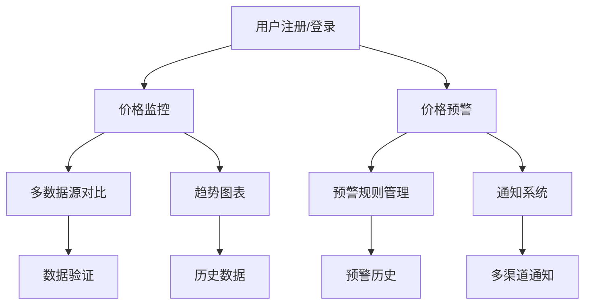
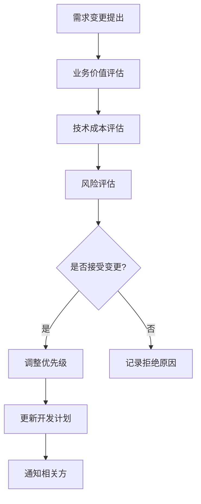

# AU贵金属价格平台需求优先级矩阵（MoSCoW法则）

## 1. MoSCoW法则说明

MoSCoW法则是一种需求优先级分类方法，将需求分为四个等级：

- **Must-have（必须有）**：产品必须具备的核心功能，没有这些功能产品无法正常工作
- **Should-have（应该有）**：重要但非必需的功能，可以延后实现
- **Could-have（可以有）**：nice-to-have的功能，如果时间允许可以实现
- **Won't-have（暂不需要）**：当前版本不需要的功能，未来可能考虑

## 2. 需求优先级矩阵

### 2.1 Must-have（必须有）

这些功能是产品的核心，没有这些功能产品将无法提供基本价值。

| 功能模块 | 具体功能 | 业务价值 | 技术复杂度 | 实现风险 | 优先级理由 |
|---------|---------|---------|-----------|----------|------------|
| **价格监控** | 实时AU价格显示 | 高 | 中 | 低 | 核心功能，用户最基本需求 |
| **价格监控** | 价格自动刷新（≤30秒） | 高 | 中 | 低 | 保证数据实时性的关键 |
| **价格预警** | 价格上限预警 | 高 | 中 | 低 | 用户最关心的功能之一 |
| **价格预警** | 价格下限预警 | 高 | 中 | 低 | 与上限预警同等重要 |
| **用户系统** | 用户注册/登录 | 高 | 低 | 低 | 使用其他功能的前提 |
| **数据管理** | 价格数据存储 | 高 | 中 | 中 | 系统运行的基础支撑 |

#### Must-have Sprint规划
- **Sprint 1**: 用户注册/登录 + 基础价格显示
- **Sprint 2**: 价格自动刷新 + 价格上限/下限预警

### 2.2 Should-have（应该有）

这些功能对用户体验很重要，但可以在Must-have功能之后实现。

| 功能模块 | 具体功能 | 业务价值 | 技术复杂度 | 实现风险 | 优先级理由 |
|---------|---------|---------|-----------|----------|------------|
| **价格监控** | 多数据源对比 | 高 | 高 | 中 | 提高数据可信度，增强竞争力 |
| **价格预警** | 涨跌幅预警 | 高 | 中 | 低 | 重要的风险控制功能 |
| **价格预警** | 预警规则管理 | 中 | 中 | 低 | 提升用户体验 |
| **数据分析** | 价格趋势图表 | 高 | 中 | 低 | 用户决策的重要参考 |
| **通知系统** | 多渠道通知（邮件/短信） | 中 | 高 | 中 | 提高预警到达率 |
| **用户系统** | 个人信息管理 | 中 | 低 | 低 | 基础的用户体验功能 |

#### Should-have Sprint规划
- **Sprint 3**: 价格趋势图表 + 涨跌幅预警
- **Sprint 4**: 多数据源对比 + 预警规则管理

### 2.3 Could-have（可以有）

这些功能能够提升产品竞争力，但实现成本较高或用户需求相对较弱。

| 功能模块 | 具体功能 | 业务价值 | 技术复杂度 | 实现风险 | 优先级理由 |
|---------|---------|---------|-----------|----------|------------|
| **数据分析** | 技术指标分析（MACD/KDJ） | 中 | 高 | 中 | 专业用户需要，但学习成本高 |
| **数据分析** | 历史数据导出 | 中 | 中 | 低 | 机构投资者需要 |
| **通知系统** | 微信通知 | 中 | 高 | 高 | 国内用户偏好，但接入复杂 |
| **价格监控** | 价格预测算法 | 中 | 高 | 高 | 有吸引力但准确性难保证 |
| **移动适配** | 移动端响应式设计 | 中 | 中 | 低 | 重要但可后续优化 |
| **API接口** | 开放数据API | 低 | 高 | 中 | 扩展生态，但当前需求不强 |

#### Could-have Sprint规划
- **Sprint 5**: 历史数据导出 + 移动端响应式
- **Sprint 6**: 技术指标分析（基础版）

### 2.4 Won't-have（暂不需要）

这些功能在当前版本中不需要，可以在未来版本考虑。

| 功能模块 | 具体功能 | 暂不实现原因 | 未来考虑时机 |
|---------|---------|-------------|-------------|
| **社交功能** | 用户评论/讨论区 | 核心功能优先，社交功能分散注意力 | 产品成熟期 |
| **高级分析** | AI价格预测 | 技术复杂度高，准确性难保证 | 数据积累充足后 |
| **多语言** | 英文/其他语言支持 | 目标用户主要为中文用户 | 国际化扩展时 |
| **高级定制** | 自定义Dashboard | 用户需求调研不足 | 用户基数大后 |
| **第三方集成** | 交易平台集成 | 合规风险高，技术复杂 | 合规完善后 |
| **高级服务** | 专家咨询服务 | 运营成本高，当前聚焦工具属性 | 商业模式成熟后 |

## 3. 需求依赖关系分析

### 3.1 功能依赖图

### 3.2 技术依赖分析

#### 3.2.1 前端依赖
- **基础组件** → **业务组件**
  - 基础UI组件库开发优先
  - 图表组件在价格监控之后开发

#### 3.2.2 后端依赖
- **数据层** → **业务层** → **接口层**
  - 数据库设计优先完成
  - 数据采集服务在价格监控之前
  - API接口在业务逻辑之后

#### 3.2.3 第三方服务依赖
- **短信服务** → **通知功能**
- **邮件服务** → **通知功能**
- **微信服务** → **微信通知**（Could-have）

## 4. 风险缓解策略

### 4.1 高风险需求应对

#### 4.1.1 多数据源对比（Should-have）
- **风险**：数据源不稳定，格式不统一
- **缓解策略**：
  - 优先接入2个最稳定的数据源
  - 建立数据格式适配层
  - 设置数据质量监控

#### 4.1.2 微信通知（Could-have）
- **风险**：微信接口政策变化，接入复杂
- **缓解策略**：
  - 先实现邮件/短信通知
  - 微信通知作为可选项
  - 考虑使用第三方推送服务

### 4.2 技术风险应对

#### 4.2.1 实时性要求
- **风险**：30秒内更新，系统压力大
- **缓解策略**：
  - 合理设置缓存策略
  - 使用异步更新机制
  - 建立降级方案

#### 4.2.2 数据准确性
- **风险**：数据源异常或错误
- **缓解策略**：
  - 多数据源交叉验证
  - 建立异常数据检测机制
  - 设置人工审核流程

## 5. 迭代开发建议

### 5.1 版本规划

#### 5.1.1 MVP版本（Sprint 1-2）
**目标**：验证核心需求，建立用户基础
- Must-have功能全部实现
- 基础UI界面
- 核心业务流程打通

#### 5.1.2 Beta版本（Sprint 3-4）
**目标**：提升用户体验，增加竞争力
- Should-have功能全部实现
- 优化界面交互
- 增加数据分析功能

#### 5.1.3 正式版本（Sprint 5-6）
**目标**：完善产品功能，准备商业化
- 部分Could-have功能
- 性能优化
- 安全加固

### 5.2 资源分配建议

#### 5.2.1 开发资源分配
- **Must-have**：60%开发资源
- **Should-have**：30%开发资源
- **Could-have**：10%开发资源
- **Won't-have**：0%开发资源

#### 5.2.2 测试资源分配
- **Must-have**：50%测试资源
- **Should-have**：35%测试资源
- **Could-have**：15%测试资源

### 5.3 里程碑设置

#### 5.3.1 第一阶段里程碑（第4周）
- 完成Must-have功能开发
- 基础功能测试通过
- 内部版本发布

#### 5.3.2 第二阶段里程碑（第8周）
- 完成Should-have功能开发
- 用户体验优化完成
- Beta版本发布

#### 5.3.3 第三阶段里程碑（第12周）
- 部分Could-have功能完成
- 性能和安全优化完成
- 正式版本发布

## 6. 需求变更管理

### 6.1 变更评估标准

#### 6.1.1 业务价值评估
- **高**：直接影响用户核心需求
- **中**：提升用户体验或竞争力
- **低**：nice-to-have的改进

#### 6.1.2 技术成本评估
- **高**：需要大量开发工作或技术攻关
- **中**：常规开发工作量
- **低**：简单修改或配置调整

#### 6.1.3 风险评估
- **高**：可能影响现有功能或稳定性
- **中**：存在一定技术或业务风险
- **低**：风险可控，影响范围小

### 6.2 变更决策流程

### 6.3 变更影响分析

#### 6.3.1 对进度的影响
- Must-have变更：必须接受，调整后续计划
- Should-have变更：评估是否影响关键里程碑
- Could-have变更：可延后到下一版本

#### 6.3.2 对资源的影响
- 评估是否需要增加开发资源
- 评估是否需要调整测试资源
- 评估是否需要延期其他功能

---

*文档版本：v1.0*
*创建时间：2026年5月*
*最后更新：2026年5月*
*负责人：产品管理团队*