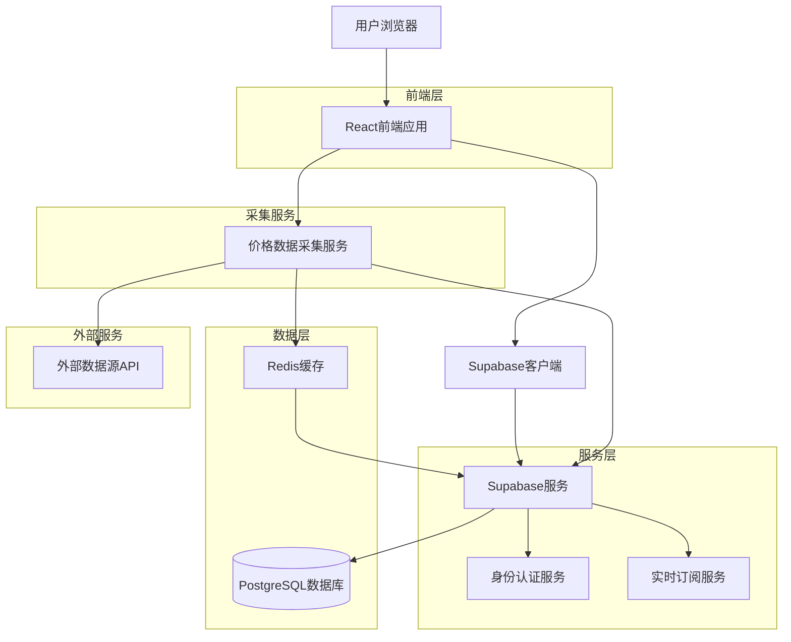
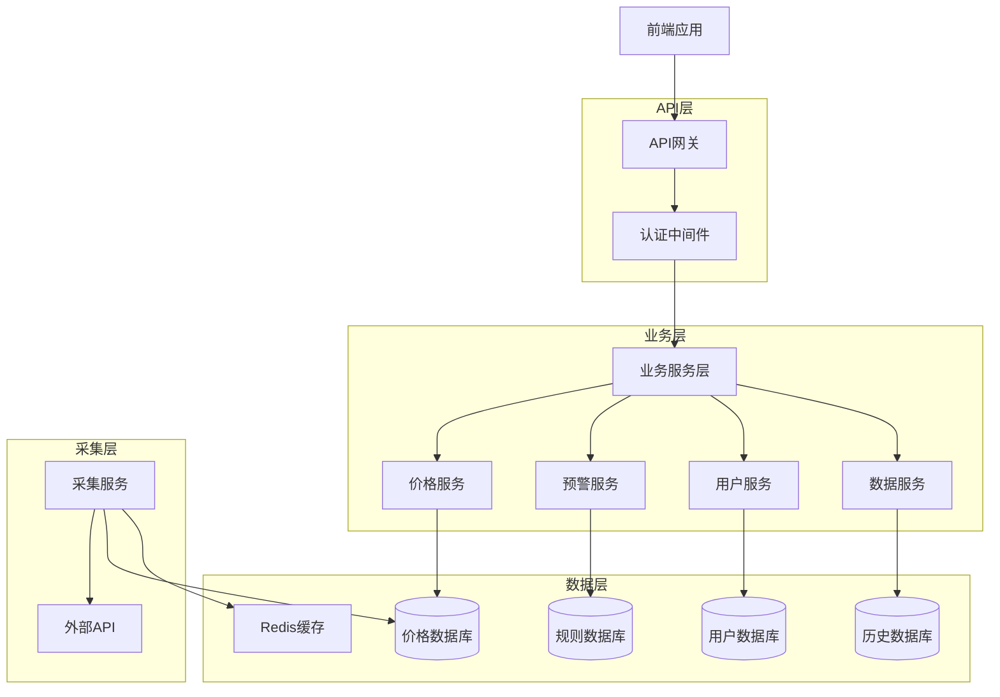
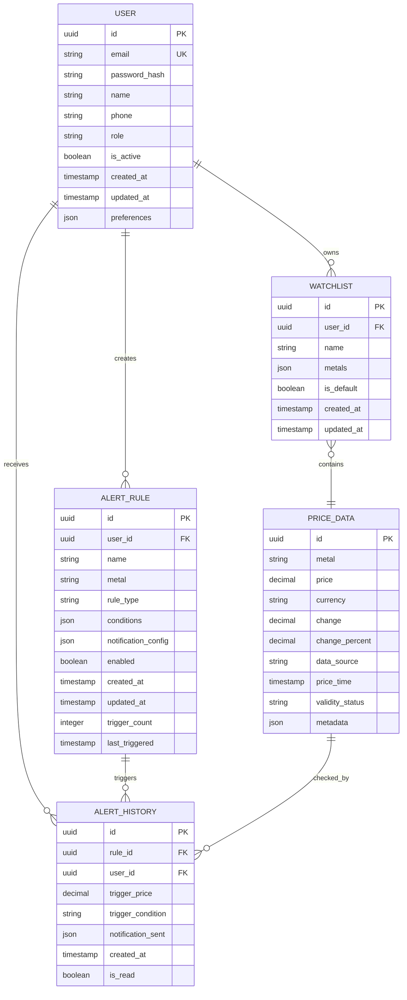

# AU贵金属价格平台系统架构设计说明书

## 1. 架构设计

### 1.1 总体架构图



### 1.2 架构组件说明

#### 1.2.1 前端层
- **React应用**：基于React 18构建的单页应用，负责用户界面展示和交互
- **技术特点**：组件化开发、响应式设计、实时数据更新

#### 1.2.2 服务层
- **Supabase**：后端即服务平台，提供数据库、认证、实时订阅等功能
- **PostgreSQL**：主数据库，存储用户数据、价格数据、预警规则等
- **身份认证**：基于Supabase Auth，支持邮箱注册登录
- **实时订阅**：WebSocket连接，实现价格数据实时推送

#### 1.2.3 数据采集层
- **采集服务**：Node.js服务，定时从多个数据源获取价格信息
- **Redis缓存**：缓存最新价格数据，提高响应速度
- **数据验证**：多源数据对比验证，确保数据准确性

## 2. 技术描述

### 2.1 前端技术栈
- **框架**：React@18.2.0
- **构建工具**：Vite@4.4.0
- **UI框架**：TailwindCSS@3.3.0
- **图表库**：Recharts@2.8.0
- **状态管理**：React Context + useReducer
- **HTTP客户端**：Axios@1.5.0
- **日期处理**：Dayjs@1.11.0

### 2.2 后端技术栈
- **后端服务**：Supabase（BaaS）
- **数据库**：PostgreSQL@15
- **缓存**：Redis@7.0
- **数据采集**：Node.js@20 + Axios
- **任务调度**：node-cron

### 2.3 初始化工具
- **前端**：vite-init
- **项目类型**：React + TypeScript

## 3. 路由定义

| 路由路径 | 页面名称 | 功能描述 |
|----------|----------|----------|
| / | 首页 | 价格监控主页，显示实时价格 |
| /login | 登录页 | 用户登录界面 |
| /register | 注册页 | 用户注册界面 |
| /dashboard | 仪表板 | 用户个人仪表板 |
| /alerts | 预警管理 | 价格预警规则管理 |
| /analysis | 数据分析 | 价格趋势分析图表 |
| /profile | 个人资料 | 用户个人信息管理 |
| /settings | 设置 | 系统设置和偏好配置 |

## 4. 接口定义

### 4.1 价格数据API

#### 4.1.1 获取实时价格
```
GET /api/prices/current
```

请求参数：
| 参数名 | 类型 | 必需 | 描述 |
|--------|------|------|------|
| metal | string | 是 | 金属类型（au） |
| source | string | 否 | 数据源名称 |

响应数据：
```json
{
  "status": "success",
  "data": {
    "metal": "au",
    "price": 450.25,
    "currency": "cny/g",
    "change": 2.15,
    "changePercent": 0.48,
    "timestamp": "2026-05-02T10:30:00Z",
    "source": "jin10",
    "validity": "high"
  }
}
```

#### 4.1.2 获取历史价格
```
GET /api/prices/history
```

请求参数：
| 参数名 | 类型 | 必需 | 描述 |
|--------|------|------|------|
| metal | string | 是 | 金属类型 |
| startDate | string | 是 | 开始日期（ISO 8601） |
| endDate | string | 是 | 结束日期（ISO 8601） |
| granularity | string | 否 | 时间粒度（1m,5m,15m,1h,4h,1d） |

### 4.2 预警规则API

#### 4.2.1 创建预警规则
```
POST /api/alerts/rules
```

请求体：
```json
{
  "name": "AU价格上限预警",
  "metal": "au",
  "type": "price_above",
  "condition": {
    "threshold": 460.00,
    "comparison": "above"
  },
  "notification": {
    "enabled": true,
    "methods": ["email", "sms"],
    "cooldown": 300
  },
  "enabled": true
}
```

#### 4.2.2 获取用户预警规则
```
GET /api/alerts/rules
```

响应数据：
```json
{
  "status": "success",
  "data": [
    {
      "id": "rule_123",
      "name": "AU价格上限预警",
      "metal": "au",
      "type": "price_above",
      "condition": {...},
      "notification": {...},
      "enabled": true,
      "createdAt": "2026-05-01T08:00:00Z",
      "triggeredCount": 5,
      "lastTriggered": "2026-05-02T09:30:00Z"
    }
  ]
}
```

## 5. 服务器架构设计

### 5.1 服务架构图



### 5.2 服务组件说明

#### 5.2.1 API网关
- **功能**：统一入口、路由分发、限流控制
- **技术**：基于Supabase Edge Functions

#### 5.2.2 业务服务层
- **价格服务**：价格数据查询、实时更新、历史数据管理
- **预警服务**：规则管理、条件检测、通知发送
- **用户服务**：用户管理、权限控制、个人设置
- **数据服务**：数据分析、报表生成、数据导出

#### 5.2.3 数据采集层
- **采集服务**：定时任务、多源数据采集、数据清洗
- **缓存层**：Redis缓存热点数据，提高响应速度

## 6. 数据模型设计

### 6.1 实体关系图



### 6.2 数据表定义

#### 6.2.1 用户表（users）
```sql
CREATE TABLE users (
    id UUID PRIMARY KEY DEFAULT gen_random_uuid(),
    email VARCHAR(255) UNIQUE NOT NULL,
    password_hash VARCHAR(255) NOT NULL,
    name VARCHAR(100) NOT NULL,
    phone VARCHAR(20),
    role VARCHAR(20) DEFAULT 'user' CHECK (role IN ('user', 'admin')),
    is_active BOOLEAN DEFAULT true,
    preferences JSONB DEFAULT '{}',
    created_at TIMESTAMP WITH TIME ZONE DEFAULT NOW(),
    updated_at TIMESTAMP WITH TIME ZONE DEFAULT NOW()
);

CREATE INDEX idx_users_email ON users(email);
CREATE INDEX idx_users_created_at ON users(created_at DESC);
```

#### 6.2.2 价格数据表（price_data）
```sql
CREATE TABLE price_data (
    id UUID PRIMARY KEY DEFAULT gen_random_uuid(),
    metal VARCHAR(10) NOT NULL,
    price DECIMAL(10,2) NOT NULL,
    currency VARCHAR(10) DEFAULT 'CNY',
    change DECIMAL(10,2) DEFAULT 0,
    change_percent DECIMAL(5,2) DEFAULT 0,
    data_source VARCHAR(50) NOT NULL,
    price_time TIMESTAMP WITH TIME ZONE NOT NULL,
    validity_status VARCHAR(20) DEFAULT 'valid' CHECK (validity_status IN ('valid', 'invalid', 'suspicious')),
    metadata JSONB DEFAULT '{}',
    created_at TIMESTAMP WITH TIME ZONE DEFAULT NOW()
);

CREATE INDEX idx_price_data_metal_time ON price_data(metal, price_time DESC);
CREATE INDEX idx_price_data_source ON price_data(data_source);
CREATE INDEX idx_price_data_created_at ON price_data(created_at DESC);
```

#### 6.2.3 预警规则表（alert_rules）
```sql
CREATE TABLE alert_rules (
    id UUID PRIMARY KEY DEFAULT gen_random_uuid(),
    user_id UUID NOT NULL REFERENCES users(id) ON DELETE CASCADE,
    name VARCHAR(100) NOT NULL,
    metal VARCHAR(10) NOT NULL,
    rule_type VARCHAR(30) NOT NULL CHECK (rule_type IN ('price_above', 'price_below', 'change_above', 'change_below')),
    conditions JSONB NOT NULL,
    notification_config JSONB NOT NULL,
    enabled BOOLEAN DEFAULT true,
    trigger_count INTEGER DEFAULT 0,
    last_triggered TIMESTAMP WITH TIME ZONE,
    created_at TIMESTAMP WITH TIME ZONE DEFAULT NOW(),
    updated_at TIMESTAMP WITH TIME ZONE DEFAULT NOW()
);

CREATE INDEX idx_alert_rules_user_id ON alert_rules(user_id);
CREATE INDEX idx_alert_rules_metal ON alert_rules(metal);
CREATE INDEX idx_alert_rules_enabled ON alert_rules(enabled);
```

#### 6.2.4 预警历史表（alert_history）
```sql
CREATE TABLE alert_history (
    id UUID PRIMARY KEY DEFAULT gen_random_uuid(),
    rule_id UUID NOT NULL REFERENCES alert_rules(id) ON DELETE CASCADE,
    user_id UUID NOT NULL REFERENCES users(id) ON DELETE CASCADE,
    trigger_price DECIMAL(10,2) NOT NULL,
    trigger_condition VARCHAR(100) NOT NULL,
    notification_sent JSONB NOT NULL,
    is_read BOOLEAN DEFAULT false,
    created_at TIMESTAMP WITH TIME ZONE DEFAULT NOW()
);

CREATE INDEX idx_alert_history_user_id ON alert_history(user_id);
CREATE INDEX idx_alert_history_rule_id ON alert_history(rule_id);
CREATE INDEX idx_alert_history_created_at ON alert_history(created_at DESC);
```

### 6.3 权限设置

#### 6.3.1 基本权限配置
```sql
-- 匿名用户权限（只读）
GRANT SELECT ON price_data TO anon;

-- 认证用户权限
GRANT ALL PRIVILEGES ON alert_rules TO authenticated;
GRANT ALL PRIVILEGES ON alert_history TO authenticated;
GRANT SELECT ON price_data TO authenticated;
GRANT SELECT ON users TO authenticated;
```

#### 6.3.2 RLS（Row Level Security）策略
```sql
-- 用户只能查看自己的预警规则
ALTER TABLE alert_rules ENABLE ROW LEVEL SECURITY;
CREATE POLICY "Users can view own alert rules" ON alert_rules
    FOR SELECT USING (auth.uid() = user_id);

-- 用户只能查看自己的预警历史
ALTER TABLE alert_history ENABLE ROW LEVEL SECURITY;
CREATE POLICY "Users can view own alert history" ON alert_history
    FOR SELECT USING (auth.uid() = user_id);
```

## 7. 非功能性需求

### 7.1 性能需求
- **响应时间**：API响应时间 ≤ 500ms（P95）
- **并发能力**：支持1000并发用户
- **数据更新**：价格数据更新延迟 ≤ 30秒
- **页面加载**：首屏加载时间 ≤ 2秒

### 7.2 可用性需求
- **系统可用性**：99.9%（年停机时间 ≤ 8.76小时）
- **数据备份**：每日自动备份，保留30天
- **故障恢复**：RTO ≤ 1小时，RPO ≤ 5分钟

### 7.3 安全需求
- **数据加密**：敏感数据AES-256加密存储
- **传输安全**：全站HTTPS，TLS 1.3
- **身份认证**：JWT令牌 + 刷新机制
- **访问控制**：基于角色的权限管理（RBAC）
- **输入验证**：防SQL注入、XSS攻击

### 7.4 扩展性需求
- **水平扩展**：支持微服务架构拆分
- **数据库扩展**：支持读写分离、分库分表
- **缓存扩展**：支持分布式缓存集群
- **负载均衡**：支持多节点部署

---

*文档版本：v1.0*
*创建时间：2026年5月*
*最后更新：2026年5月*