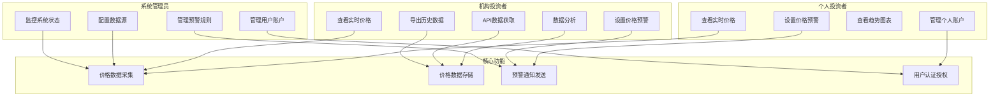
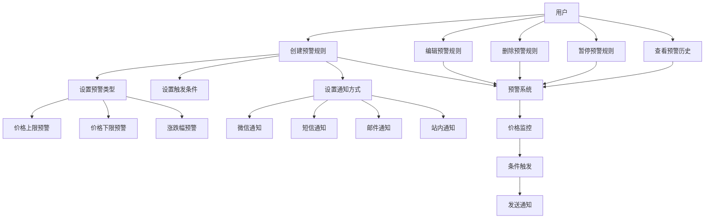
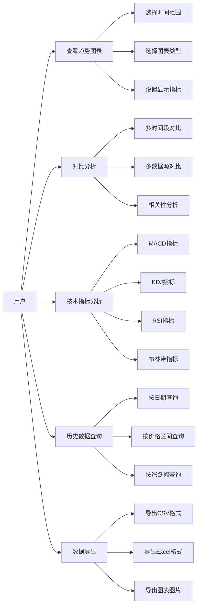
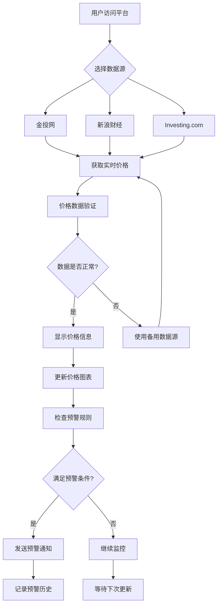
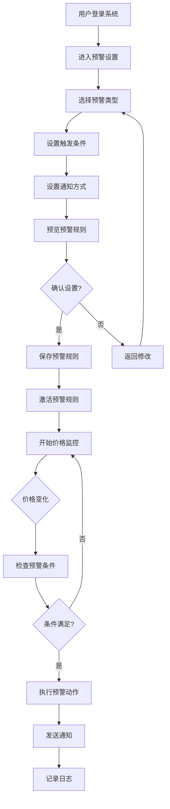

# AU贵金属价格平台用户故事地图与UML用例图

## 1. 用户故事地图

### 1.1 用户角色定义

#### 1.1.1 个人投资者（Primary User）
- **目标**：获取实时价格信息，及时获知价格变化
- **特征**：关注短期波动，需要简单易用的界面

#### 1.1.2 机构投资者（Professional User）
- **目标**：获取准确数据进行分析决策
- **特征**：需要深度数据分析和API接口

#### 1.1.3 系统管理员（Admin User）
- **目标**：维护系统正常运行，管理用户和数据
- **特征**：需要完整的管理功能

### 1.2 用户故事地图结构

```
用户活动 → 用户任务 → 用户故事

价格监控活动
├── 查看实时价格
│   ├── 作为个人投资者，我想要查看AU实时价格，以便了解当前市场行情
│   ├── 作为机构投资者，我想要查看多数据源价格对比，以便验证价格准确性
│   └── 作为个人投资者，我想要查看不同时间粒度价格，以便分析短期趋势

价格预警活动
├── 设置价格预警
│   ├── 作为个人投资者，我想要设置价格上限预警，以便及时卖出
│   ├── 作为个人投资者，我想要设置价格下限预警，以便及时买入
│   └── 作为机构投资者，我想要设置涨跌幅预警，以便控制风险
├── 管理预警规则
│   ├── 作为个人投资者，我想要编辑预警规则，以便调整投资策略
│   ├── 作为个人投资者，我想要删除预警规则，以便取消不需要的预警
│   └── 作为个人投资者，我想要暂停预警规则，以便临时关闭预警

数据分析活动
├── 趋势分析
│   ├── 作为个人投资者，我想要查看价格趋势图表，以便判断买卖时机
│   ├── 作为机构投资者，我想要进行多周期对比分析，以便制定投资策略
│   └── 作为个人投资者，我想要查看历史价格数据，以便学习价格规律

账户管理活动
├── 用户注册登录
│   ├── 作为新用户，我想要注册账户，以便使用平台功能
│   ├── 作为注册用户，我想要登录系统，以便访问个人数据
│   └── 作为注册用户，我想要重置密码，以便恢复账户访问

系统管理活动
├── 数据源管理
│   ├── 作为系统管理员，我想要配置数据源，以便确保数据准确性
│   ├── 作为系统管理员，我想要监控数据质量，以便及时发现异常
│   └── 作为系统管理员，我想要设置数据更新频率，以便平衡实时性与性能
```

### 1.3 用户故事优先级

#### 1.3.1 高优先级（Sprint 1-2）
- 查看AU实时价格
- 设置价格预警
- 用户注册登录
- 查看价格趋势图表

#### 1.3.2 中优先级（Sprint 3-4）
- 多数据源价格对比
- 编辑/删除预警规则
- 多周期对比分析
- 历史价格数据查询

#### 1.3.3 低优先级（Sprint 5+）
- 技术指标分析
- API接口服务
- 高级数据分析功能
- 系统管理功能

## 2. UML用例图

### 2.1 总体用例图



### 2.2 价格监控用例图

```mermaid
graph LR
    Actor[个人投资者] --> UC1[查看实时价格]
    Actor --> UC2[选择时间粒度]
    Actor --> UC3[对比多数据源]
    Actor --> UC4[刷新价格数据]
    
    UC1 --> System[价格监控系统]
    UC2 --> System
    UC3 --> System
    UC4 --> System
    
    System --> DataSource1[金投网数据源]
    System --> DataSource2[新浪财经数据源]
    System --> DataSource3[Investing数据源]
    
    note right of System
        系统每30秒
        自动更新价格
    end note
```

### 2.3 价格预警用例图



### 2.4 数据分析用例图



## 3. 核心业务流程

### 3.1 价格监控业务流程



### 3.2 预警设置业务流程



## 4. 功能清单

### 4.1 核心功能模块

#### 4.1.1 价格监控模块
- [ ] 实时价格显示
- [ ] 多数据源对比
- [ ] 价格自动刷新
- [ ] 价格数据缓存
- [ ] 数据异常检测

#### 4.1.2 价格预警模块
- [ ] 价格上限预警
- [ ] 价格下限预警
- [ ] 涨跌幅预警
- [ ] 预警规则管理
- [ ] 多渠道通知
- [ ] 预警历史记录

#### 4.1.3 数据分析模块
- [ ] 价格趋势图表
- [ ] 多时间段对比
- [ ] 技术指标分析
- [ ] 历史数据查询
- [ ] 数据导出功能

#### 4.1.4 用户管理模块
- [ ] 用户注册登录
- [ ] 个人信息管理
- [ ] 偏好设置
- [ ] 账户安全

#### 4.1.5 系统管理模块
- [ ] 数据源配置
- [ ] 系统监控
- [ ] 用户管理
- [ ] 日志管理

### 4.2 非功能性需求

#### 4.2.1 性能需求
- 价格更新延迟 ≤ 30秒
- 页面响应时间 ≤ 2秒
- 支持并发用户 ≥ 1000
- 系统可用性 ≥ 99.9%

#### 4.2.2 安全需求
- 用户数据加密存储
- API接口安全认证
- 防止SQL注入攻击
- 防止XSS攻击

#### 4.2.3 可靠性需求
- 数据备份机制
- 故障恢复能力
- 数据一致性保证
- 系统监控告警

## 5. 用户故事验收标准

### 5.1 价格监控用户故事验收标准

#### 5.1.1 查看实时价格
- **Given**: 用户已登录系统
- **When**: 用户访问价格监控页面
- **Then**: 系统显示最新的AU价格信息
- **And**: 价格更新时间不超过30秒
- **And**: 显示数据来源标识

#### 5.1.2 多数据源对比
- **Given**: 用户选择多数据源对比功能
- **When**: 系统获取多个数据源价格
- **Then**: 显示各数据源价格对比
- **And**: 标识价格差异
- **And**: 提供数据源可信度评分

### 5.2 价格预警用户故事验收标准

#### 5.2.1 设置价格预警
- **Given**: 用户已登录系统
- **When**: 用户设置价格预警规则
- **Then**: 系统保存预警规则
- **And**: 立即激活价格监控
- **And**: 发送设置成功通知

#### 5.2.2 预警通知发送
- **Given**: 价格达到预警条件
- **When**: 系统检测到价格变化
- **Then**: 立即发送预警通知
- **And**: 记录预警历史
- **And**: 标记预警状态

---

*文档版本：v1.0*
*创建时间：2026年5月*
*最后更新：2026年5月*